# 1、OC对象的本质

## 1.1 OC底层实现

我们平时编写的Objective-C代码，底层实现其实都是C\C++代码。Objective-C的对象、类主要是基于C\C++的结构体实现。


## 1.2 将Objective-C代码转换为C\C++代码

>xcrun  -sdk  iphoneos  clang  -arch  arm64  -rewrite-objc  OC源文件  -o  输出的CPP文件。	
>如果需要链接其他框架，使用-framework参数。比如-framework UIKit

## 1.3 NSObject的底层实现

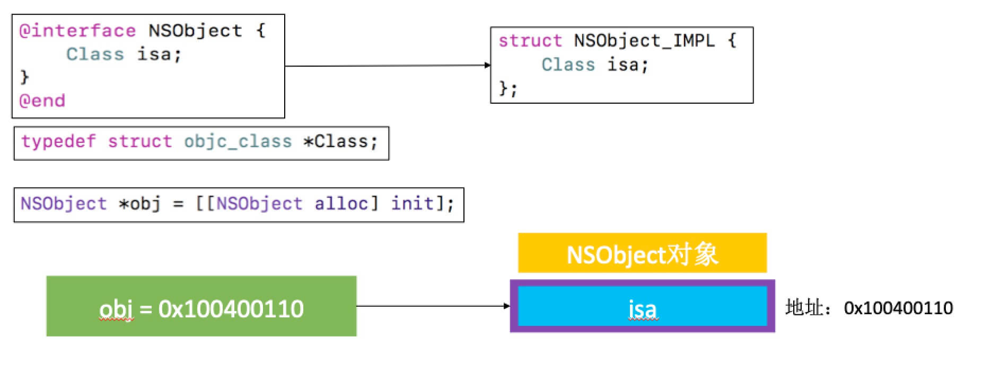
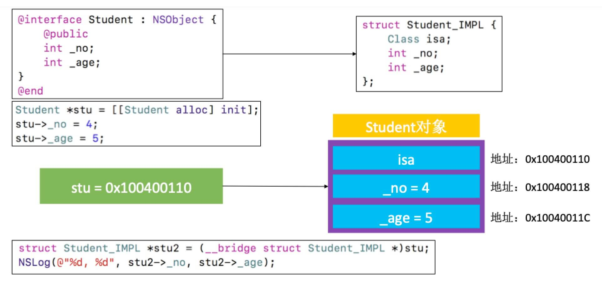
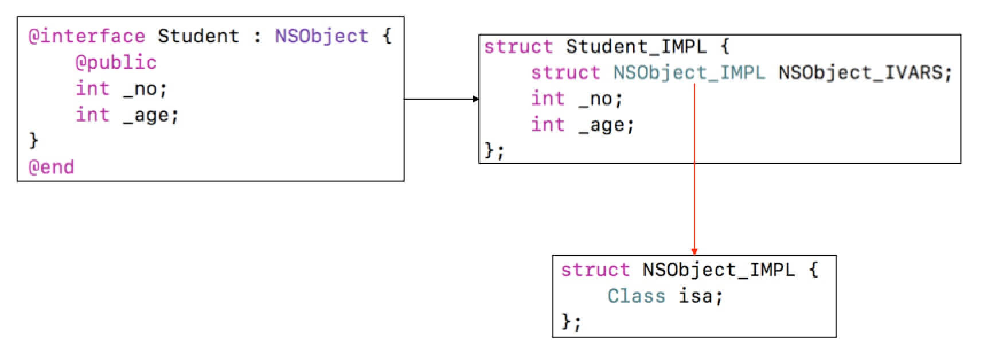


## 1.4 实时查看内存数据

### 1.4.1 ViewMemory

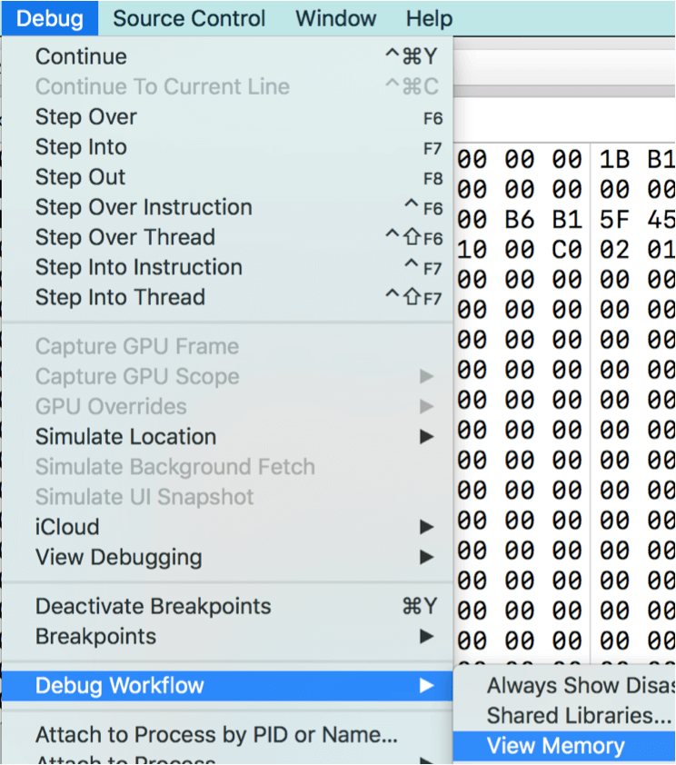

### 1.4.2 LLDB指令

>print、p：打印
>po：打印对象
>
>读取内存
>memory read/数量格式字节数  内存地址
>x/数量格式字节数  内存地址
>x/3xw  0x10010
>
>格式
>x是16进制
>f是浮点
>d是10进制
>
>字节大小
>b：byte 1字节
>h：half word 2字节
>w：word 4字节
>g：giant word 8字节
>
>修改内存中的值
>memory  write  内存地址  数值
>memory  write  0x0000010  10

## 1.5 结构体内存分配

[结构体大小计算](http://www.cnblogs.com/xieyajie/p/8094788.html)

## 1.6 sizeof注意点

sizeof是编译器特性，在编译的时候直接进行常理替换，并不是函数。class_getInstanceSize需要在运行时确定大小。

## 面试题

* 1.1一个NSObject对象占用多少内存？

```
 NSObject *obj = [[NSObject alloc] init];
// 16个字节
    
// 获得NSObject实例对象的成员变量所占用的大小 =8
NSLog(@"%zd", class_getInstanceSize([NSObject class]));//8
    
// 系统分配了16个字节给NSObject对象
//CF requires all objects be at least 16 bytes
NSLog(@"%zd", malloc_size((__bridge const void *)obj));//16

苹果系统分配内存源码
https://opensource.apple.com/tarballs/libmalloc/
malloc.c/calloc  Buckets sized {16,32,64,80,96,112,...}
操作系统分配内存也有对齐，16的整数倍

创建一个实例对象，至少需要多少内存？//结构体内存对齐
#import <objc/runtime.h>
class_getInstanceSize([NSObject class]);

建一个实例对象，实际上分配了多少内存？//操作系统分配内存也会对齐，16的整数倍
#import <malloc/malloc.h>
malloc_size((__bridge const void *)obj);

sizeof()也能计算出大小

gnu（glibc/malloc/MALLOC_ALIGNMENT=16 c语言源码）是一个开源组织也提供了相关源码

```

# 2、OC对象的分类
## 2.1 Objective-C中的对象，简称OC对象，主要可以分为3种

* instance对象（实例对象）
* class对象（类对象）
* meta-class对象（元类对象） 

### 2.1.1 instance
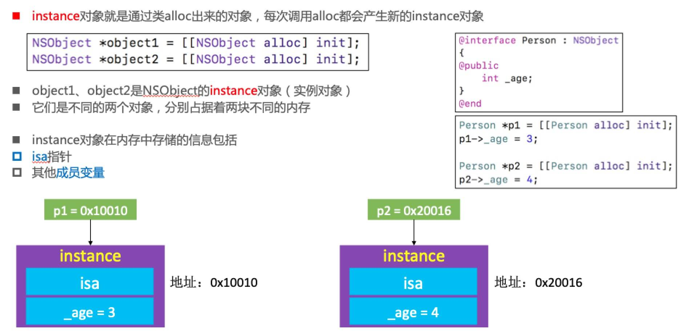
### 2.1.2 class
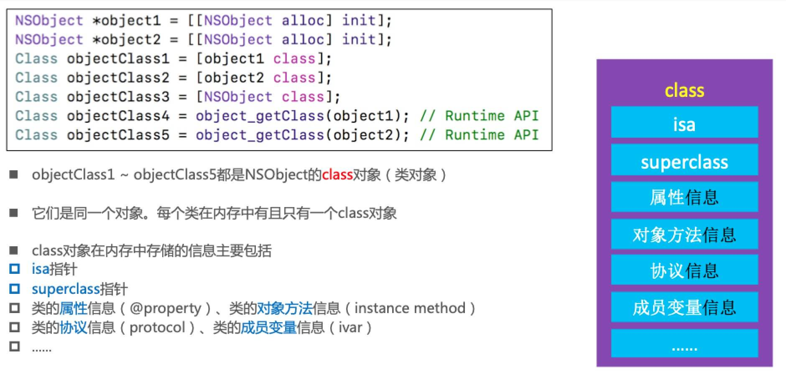
### 2.1.3 meta-class


### 2.1.4 注意


### 2.1.5 查看Class是否为meta-class


## 2.2 object_getClass内部实现
https://opensource.apple.com/tarballs/	
objc4/objc-runtime.mm

```
/*
 1.Class objc_getClass(const char *aClassName)
 1> 传入字符串类名
 2> 返回对应的类对象
 
 2.Class object_getClass(id obj)
 1> 传入的obj可能是instance对象、class对象、meta-class对象
 2> 返回值
 a) 如果是instance对象，返回class对象
 b) 如果是class对象，返回meta-class对象
 c) 如果是meta-class对象，返回NSObject（基类）的meta-class对象
 
 3.- (Class)class、+ (Class)class
 1> 返回的就是类对象
 
 - (Class) {
     return self->isa;
 }
 
 + (Class) {
     return self;
 }
 */
```
## 2.3 isa指针
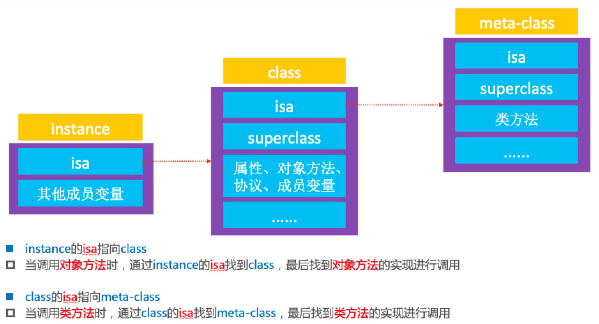

## 2.4 class对象的superclass指针
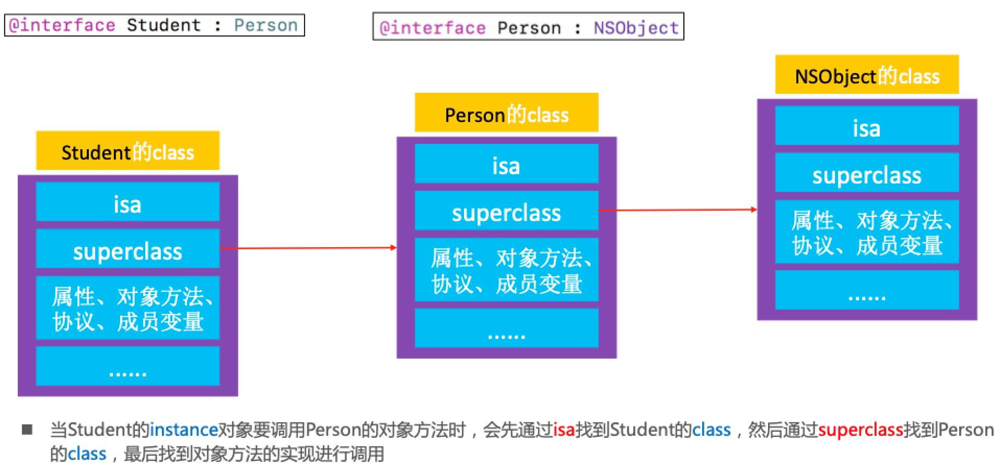
## 2.5 meta-class对象的superclass指

## 2.6 isa、superclass总结

## 2.7 class结构体
### 2.7.1 isa指针


```
struct mj_objc_class {
    Class isa;
    Class superclass;
};

        // MJPerson类对象的地址：0x00000001000014c8
        // isa & ISA_MASK：0x00000001000014c8
        
        // MJPerson实例对象的isa：0x001d8001000014c9
        
        struct mj_objc_class *personClass = (__bridge struct mj_objc_class *)([MJPerson class]);
        
        struct mj_objc_class *studentClass = (__bridge struct mj_objc_class *)([MJStudent class]);
        
        NSLog(@"1111");
        
//        MJPerson *person = [[MJPerson alloc] init];
//
        
//        Class personClass = [MJPerson class];
        
//        struct mj_objc_class *personClass2 = (__bridge struct mj_objc_class *)(personClass);
//
//        Class personMetaClass = object_getClass(personClass);
//
//        NSLog(@"%p %p %p", person, personClass, personMetaClass);
//        MJStudent *student = [[MJStudent alloc] init];

```
```
64bit之前isa = 对象地址，从64bit开始，isa需要进行一次位运算，才能计算出真实地址	
p/x (long)person->isa
输出
0x001d8001000014c9

p/x persionClass 
输出
0x00000001000014c8

p/x 0x001d8001000014c9 & 0x00007ffffffffff8（x86下ISA_MASK）
输出
0x00000001000014c8

```
### 2.7.2 objc4源码下载
* https://opensource.apple.com/tarballs/objc4/

* class、meta-class对象的本质结构都是struct objc_class

### 2.7.3 窥探struct objc_class的结构
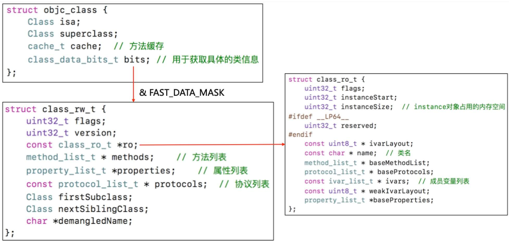

[objc_class的结构项目](./project/objc_class的结构)

## 面试题 

* 对象的isa指针指向哪里？

```
instance对象的isa指向class对象
class对象的isa指向meta-class对象
meta-class对象的isa指向基类的meta-class对象
```

* OC的类信息存放在哪里？
  
```
对象方法、属性、成员变量、协议信息，存放在class对象中
类方法，存放在meta-class对象中
成员变量的具体值，存放在instance对象

```

# 3、KVO

>KVO的全称是Key-Value Observing，俗称“键值监听”，可以用于监听某个对象属性值的改变


```
@interface ViewController ()
@property (strong, nonatomic) MJPerson *person1;
@property (strong, nonatomic) MJPerson *person2;
@end

@implementation ViewController

- (void)viewDidLoad {
    [super viewDidLoad];
    
    self.person1 = [[MJPerson alloc] init];
    self.person1.age = 1;
    self.person1.height = 11;
    
    self.person2 = [[MJPerson alloc] init];
    self.person2.age = 2;
    self.person2.height = 22;
    
    // 给person1对象添加KVO监听
    NSKeyValueObservingOptions options = NSKeyValueObservingOptionNew | NSKeyValueObservingOptionOld;
    [self.person1 addObserver:self forKeyPath:@"age" options:options context:@"123"];
    [self.person1 addObserver:self forKeyPath:@"height" options:options context:@"456"];
}

- (void)touchesBegan:(NSSet<UITouch *> *)touches withEvent:(UIEvent *)event
{
    self.person1.age = 20;
    self.person2.age = 20;
    
    self.person1.height = 30;
    self.person2.height = 30;
}

- (void)dealloc {
    [self.person1 removeObserver:self forKeyPath:@"age"];
    [self.person1 removeObserver:self forKeyPath:@"height"];
}

// 当监听对象的属性值发生改变时，就会调用
- (void)observeValueForKeyPath:(NSString *)keyPath ofObject:(id)object change:(NSDictionary<NSKeyValueChangeKey,id> *)change context:(void *)context
{
    NSLog(@"监听到%@的%@属性值改变了 - %@ - %@", object, keyPath, change, context);
}

```

[KVODemo](./project/3.0_1)

## 3.1 未使用KVO监听的对象


## 3.2 使用了KVO监听的对象

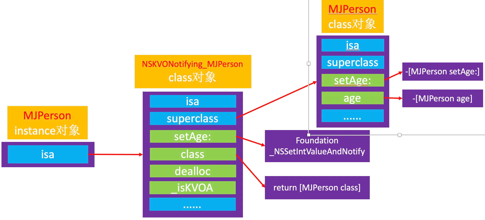

## 3.3 查看_NSSet*AndNotify的存在

```
@interface MJPerson : NSObject
@property (assign, nonatomic) int age;
@end

@implementation MJPerson

- (void)setAge:(int)age
{
    _age = age;
    
    NSLog(@"setAge:");
}

//- (int)age
//{
//    return _age;
//}

- (void)willChangeValueForKey:(NSString *)key
{
    [super willChangeValueForKey:key];
    
    NSLog(@"willChangeValueForKey");
}

- (void)didChangeValueForKey:(NSString *)key
{
    NSLog(@"didChangeValueForKey - begin");
    
    [super didChangeValueForKey:key];
    
    NSLog(@"didChangeValueForKey - end");
}

//ViewController
- (void)viewDidLoad {
    [super viewDidLoad];
    
    self.person1 = [[MJPerson alloc] init];
    self.person1.age = 1;
    
    self.person2 = [[MJPerson alloc] init];
    self.person2.age = 2;
    
    
//    NSLog(@"person1添加KVO监听之前1 - %@ %@",
//          object_getClass(self.person1),
//          object_getClass(self.person2));

//    NSLog(@"person1添加KVO监听之前2 - %p %p",
//          [self.person1 methodForSelector:@selector(setAge:)],
//          [self.person2 methodForSelector:@selector(setAge:)]);
    
    // 给person1对象添加KVO监听
    NSKeyValueObservingOptions options = NSKeyValueObservingOptionNew | NSKeyValueObservingOptionOld;
    [self.person1 addObserver:self forKeyPath:@"age" options:options context:@"123"];
    
//    NSLog(@"person1添加KVO监听之后1 - %@ %@",
//          object_getClass(self.person1),
//          object_getClass(self.person2));
//    NSLog(@"person1添加KVO监听之后2 - %p %p",
//          [self.person1 methodForSelector:@selector(setAge:)],
//          [self.person2 methodForSelector:@selector(setAge:)]);
//
//
//    NSLog(@"类对象 - %@ %@",
//          object_getClass(self.person1),  // self.person1.isa
//          object_getClass(self.person2)); // self.person2.isa
//    NSLog(@"类对象 - %p %p",
//          object_getClass(self.person1),  // self.person1.isa
//          object_getClass(self.person2)); // self.person2.isa
//
//    NSLog(@"元类对象 - %@ %@",
//          object_getClass(object_getClass(self.person1)), // self.person1.isa.isa
//          object_getClass(object_getClass(self.person2))); // self.person2.isa.isa
//    NSLog(@"元类对象 - %p %p",
//          object_getClass(object_getClass(self.person1)), // self.person1.isa.isa
//          object_getClass(object_getClass(self.person2))); // self.person2.isa.isa

//Log查看方法
persion1添加KVO监听之前2 - 0x1065687c0 0x1065687c0
persion1添加KVO监听之后2 - 0x1069189e4 0x1065687c0

p (IMP)0x1065687c0
(IMP) $0 0x00... (Interview01`-[MJPerson setAge:] at MJPerson.m13)

p (IMP)0x1069189e4
(IMP) $1 0x00... (Foundation`_NSSetIntValueAndNotify)
    
}

类对象 - NSKVONotifying_MJPerson MJPersion
元类对象 - NSKVONotifying_MJPerson MJPersion

- (void)touchesBegan:(NSSet<UITouch *> *)touches withEvent:(UIEvent *)event
{
    // NSKVONotifying_MJPerson是使用Runtime动态创建的一个类，是MJPerson的子类
    // self.person1.isa == NSKVONotifying_MJPerson
    [self.person1 setAge:21];
    
    // self.person2.isa = MJPerson
//    [self.person2 setAge:22];
}

- (void)dealloc {
    [self.person1 removeObserver:self forKeyPath:@"age"];
}

// 当监听对象的属性值发生改变时，就会调用
- (void)observeValueForKeyPath:(NSString *)keyPath ofObject:(id)object change:(NSDictionary<NSKeyValueChangeKey,id> *)change context:(void *)context
{
    NSLog(@"监听到%@的%@属性值改变了 - %@ - %@", object, keyPath, change, context);
}

```


## 3.4 _NSSet*ValueAndNotify的内部实现


```
调用willChangeValueForKey:
调用原来的setter实现
调用didChangeValueForKey:
didChangeValueForKey:内部会调用observer的observeValueForKeyPath:ofObject:change:context:方法
```

### 3.5 KVO子类的内部方法
 ```
 通过runtime获取方法类表。就知道有下面方法
 - (void)printMethodNamesOfClass:(Class)cls {
    unsigned int count;
    // 获得方法数组
    Method *methodList = class_copyMethodList(cls, &count);
    
    // 存储方法名
    NSMutableString *methodNames = [NSMutableString string];
    
    // 遍历所有的方法
    for (int i = 0; i < count; i++) {
        // 获得方法
        Method method = methodList[i];
        // 获得方法名
        NSString *methodName = NSStringFromSelector(method_getName(method));
        // 拼接方法名
        [methodNames appendString:methodName];
        [methodNames appendString:@", "];
    }
    
    // 释放
    free(methodList);
    
    // 打印方法名
    NSLog(@"%@ %@", cls, methodNames);
}

 @implementation NSKVONotifying_MJPerson

- (void)setAge:(int)age
{
    _NSSetIntValueAndNotify();
}

// 屏幕内部实现，隐藏了NSKVONotifying_MJPerson类的存在
- (Class)class
{
    return [MJPerson class];
}

- (void)dealloc
{
    // 收尾工作
}

- (BOOL)_isKVOA
{
    return YES;
}

@end
 ```

 ## 面试题
 
 * iOS用什么方式实现对一个对象的KVO？(KVO的本质是什么？)

```
利用RuntimeAPI动态生成一个子类，并且让instance对象的isa指向这个全新的子类
当修改instance对象的属性时，会调用Foundation的_NSSetXXXValueAndNotify函数
willChangeValueForKey:
父类原来的setter
didChangeValueForKey:
内部会触发监听器（Oberser）的监听方法( observeValueForKeyPath:ofObject:change:context:）
```

* 如何手动触发KVO？

```
手动调用willChangeValueForKey:和didChangeValueForKey:
```

* 直接修改成员变量会触发KVO么？

```
不会触发KVO
```

# 4、KVC

## 4.1 概述

>KVC的全称是Key-Value Coding，俗称“键值编码”，可以通过一个key来访问某个属性

常见的API有

```
- (void)setValue:(id)value forKeyPath:(NSString *)keyPath;
- (void)setValue:(id)value forKey:(NSString *)key;
- (id)valueForKeyPath:(NSString *)keyPath;
- (id)valueForKey:(NSString *)key;
```
## 4.2 setValue:forKey:的原理


* accessInstanceVariablesDirectly方法的默认返回值是YES


## 4.3 valueForKey:的原理

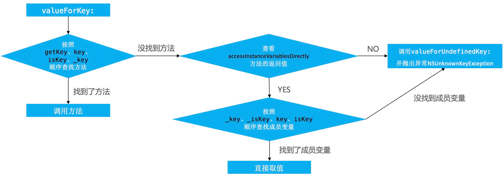

## 面试题

### 通过KVC修改属性会触发KVO么？

```
通过kvo监听某个属性，如果修改属性，会触发kvo，如果用 -> 直接修改成员变量，不会触发KVO。
如果通过kvc修改类的变量，不管是属性还是成员变量，只用通过kvo监听这个变量都很触发kvo。（即都很收到属性变化的通知）
kvo监听某个属性，系统通过runtime生成NSKVONotififying_XXX子类重写set方法。发通知（见上面kvo原理）
kvc在setValue:forKey/setValue:forKeyPath中调用willChangeValueForKey、didChangeValueForKey（必须成对出现，要不然不会发通知），在didChangeValueForKey中会发通知变量改变
```

### KVC的赋值和取值过程是怎样的？原理是什么？

# 5、Category

## 5.1 Category的底层结构

定义在objc-runtime-new.h中


## 5.2 Category的加载处理过程

1. 通过Runtime加载某个类的所有Category数据
2. 把所有Category的方法、属性、协议数据，合并到一个大数组中
后面参与编译的Category数据，会在数组的前面
3. 将合并后的分类数据（方法、属性、协议），插入到类原来数据的前面，多个分类最后面编译的分类添加在类原来数据的最前面。

>注意：通过runtime在运行时将分类的方法合并到类对象和元类对象中。

```
源码解读顺序
objc-os.mm
_objc_init
map_images
map_images_nolock

objc-runtime-new.mm
_read_images
remethodizeClass
attachCategories
attachLists
realloc、memmove、 memcpy
```

原类添加分类原理图，如果找到方法之后就不会继续往下找了，其他分类和原类中的同名方法还在，但是不会被执行。


## 5.3 +load方法

* +load方法会在runtime加载类、分类时调用
* 每个类、分类的+load，在程序运行过程中只调用一次
* 调用顺序
    1. 先调用类的+load
        1. 按照编译先后顺序调用（先编译，先调用）
        2. 调用子类的+load之前会先调用父类的+load
    2. 再调用分类的+load
        1. 按照编译先后顺序调用（先编译，先调用）

```
objc4源码解读过程：objc-os.mm
_objc_init

load_images

prepare_load_methods
schedule_class_load
add_class_to_loadable_list
add_category_to_loadable_list

call_load_methods
call_class_loads
call_category_loads
(*load_method)(cls, SEL_load)
```

* +load方法是根据方法地址直接调用，并不是经过objc_msgSend函数调用

## 5.4 +initialize方法

* +initialize方法会在类第一次接收到消息时调用
* 调用顺序
    1. 先调用父类的+initialize，再调用子类的+initialize
    2. (先初始化父类，再初始化子类，每个类只会初始化1次)

```
objc4源码解读过程
objc-msg-arm64.s
objc_msgSend

objc-runtime-new.mm
class_getInstanceMethod
lookUpImpOrNil
lookUpImpOrForward
_class_initialize
callInitialize
objc_msgSend(cls, SEL_initialize)
```

* +initialize和+load的很大区别是，+initialize是通过objc_msgSend进行调用的，所以有以下特点:
    * 如果子类没有实现+initialize，会调用父类的+initialize（所以父类的+initialize可能会被调用多次）
    * 如果分类实现了+initialize，就覆盖类本身的+initialize调用

# 6、关联对象

## 6.1 如何实现给分类“添加成员变量”？

默认情况下，因为分类底层结构的限制，不能添加成员变量到分类中。但可以通过关联对象来间接实现
关联对象提供了以下API:
1、添加关联对象

```
void objc_setAssociatedObject(id object, const void * key, id value, objc_AssociationPolicy policy)
```

2、获得关联对象

```
id objc_getAssociatedObject(id object, const void * key
```

3、移除所有的关联对象

```
void objc_removeAssociatedObjects(id object)
```

## 6.2 key的常见用

```
static void *MyKey = &MyKey;
objc_setAssociatedObject(obj, MyKey, value, OBJC_ASSOCIATION_RETAIN_NONATOMIC)
objc_getAssociatedObject(obj, MyKey)

static char MyKey;
objc_setAssociatedObject(obj, &MyKey, value, OBJC_ASSOCIATION_RETAIN_NONATOMIC)
objc_getAssociatedObject(obj, &MyKey)

使用属性名作为key
objc_setAssociatedObject(obj, @"property", value, OBJC_ASSOCIATION_RETAIN_NONATOMIC);
objc_getAssociatedObject(obj, @"property");

使用get方法的@selecor作为key
objc_setAssociatedObject(obj, @selector(getter), value, OBJC_ASSOCIATION_RETAIN_NONATOMIC)
objc_getAssociatedObject(obj, @selector(getter))
```

## 6.3 objc_AssociationPolicy


## 6.4 关联对象的原理

实现关联对象技术的核心对象有

* AssociationsManager
* AssociationsHashMap
* ObjectAssociationMap
* ObjcAssociation

objc4源码解读：objc-references.mm


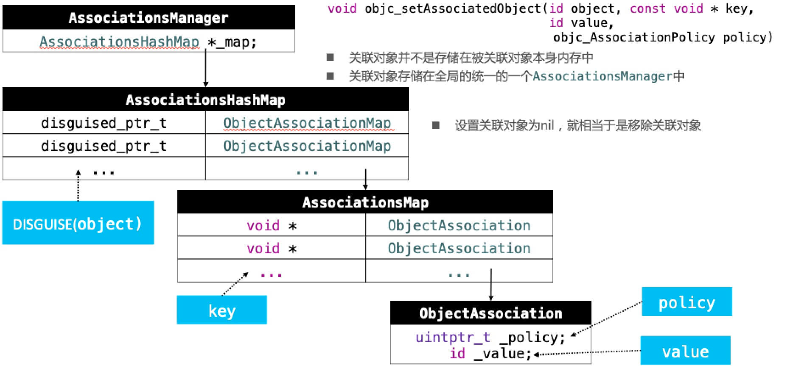

# 7、Block
## 7.1 block的本质

* block本质上也是一个OC对象，它内部也有个isa指针
* 是封装了函数调用以及函数调用环境的OC对象
* block的底层结构如图所示


## 7.2 block的变量捕获（capture）

* 为了保证block内部能够正常访问外部的变量，block有个变量捕获机制


* auto变量的捕获


## 7.3 block的类型
block有3种类型，可以通过调用class方法或者isa指针查看具体类型，最终都是继承自NSBlock类型

* __NSGlobalBlock__ （ _NSConcreteGlobalBlock ）
* __NSStackBlock__ （ _NSConcreteStackBlock ）
* __NSMallocBlock__ （ _NSConcreteMallocBlock ）


每一种类型的block调用copy后的结果如下所示


## 7.4 block的copy

在ARC环境下，编译器会根据情况自动将栈上的block复制到堆上，比如以下情况

* block作为函数返回值时
* 将block赋值给__strong指针时
* block作为Cocoa API中方法名含有usingBlock的方法参数时
* block作为GCD API的方法参数时

MRC下block属性的建议写法
```
@property (copy, nonatomic) void (^block)(void);
```

ARC下block属性的建议写法

```
@property (strong, nonatomic) void (^block)(void);
@property (copy, nonatomic) void (^block)(void);
```

## 7.5 对象类型的auto变量

当block内部访问了对象类型的auto变量时

* 如果block是在栈上，将不会对auto变量产生强引用
* 如果block被拷贝到堆上
    * 会调用block内部的copy函数
    * copy函数内部会调用_Block_object_assign函数
    * _Block_object_assign函数会根据auto变量的修饰符（__strong、__weak、__unsafe_unretained）做出相应的操作，形成强引用（retain）或者弱引用
* 如果block从堆上移除
    * 会调用block内部的dispose函数
    * dispose函数内部会调用_Block_object_dispose函数
    * _Block_object_dispose函数会自动释放引用的auto变量（release）


## 7.6 __weak问题解决

在使用clang转换OC为C++代码时，可能会遇到以下问题

>cannot create __weak reference in file using manual reference

解决方案：支持ARC、指定运行时系统版本，比如

>xcrun -sdk iphoneos clang -arch arm64 -rewrite-objc -fobjc-arc -fobjc-runtime=ios-8.0.0 main.m

## 7.7 __block修饰符

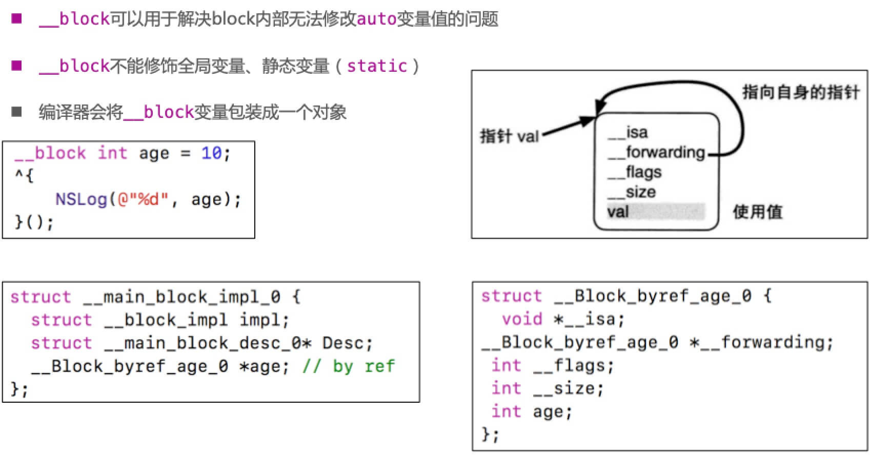

## 7.8 __block的内存管理

* 当block在栈上时，并不会对__block变量产生强引用
* 当block被copy到堆时
    * 会调用block内部的copy函数
    * copy函数内部会调用_Block_object_assign函数
    * _Block_object_assign函数会对__block变量形成强引用（retain）


* 当block从堆中移除时
    * 会调用block内部的dispose函数
    * dispose函数内部会调用_Block_object_dispose函数
    * _Block_object_dispose函数会自动释放引用的__block变量（release)
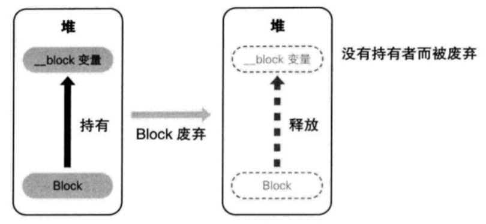


## 7.9 __block的__forwarding指针


## 7.10 对象类型的auto变量、__block变量
* 当block在栈上时，对它们都不会产生强引用
* 当block拷贝到堆上时，都会通过copy函数来处理它们

```
__block变量（假设变量名叫做a）
_Block_object_assign((void*)&dst->a, (void*)src->a, 8/*BLOCK_FIELD_IS_BYREF*/);

对象类型的auto变量（假设变量名叫做p）
_Block_object_assign((void*)&dst->p, (void*)src->p, 3/*BLOCK_FIELD_IS_OBJECT*/);
```

* 当block从堆上移除时，都会通过dispose函数来释放它们

```
__block变量（假设变量名叫做a）
_Block_object_dispose((void*)src->a, 8/*BLOCK_FIELD_IS_BYREF*/);

对象类型的auto变量（假设变量名叫做p）
_Block_object_dispose((void*)src->p, 3/*BLOCK_FIELD_IS_OBJECT*/);
```


## 7.11 被__block修饰的对象类型

* 当__block变量在栈上时，不会对指向的对象产生强引用
* 当__block变量被copy到堆时
    * 会调用__block变量内部的copy函数
    * copy函数内部会调用_Block_object_assign函数
    * _Block_object_assign函数会根据所指向对象的修饰符（__strong、__weak、__unsafe_unretained）做出相应的操作，形成强引用（retain）或者弱引用（注意：这里仅限于ARC时会retain，MRC时不会retain）
* 如果__block变量从堆上移除
    * 会调用__block变量内部的dispose函数
    * dispose函数内部会调用_Block_object_dispose函数
    * _Block_object_dispose函数会自动释放指向的对象（release）

## 7.12 循环引用问题


### 7.12.1 解决循环引用问题 - ARC

* 用__weak、__unsafe_unretained解决


* 用__block解决（必须要调用block）


### 7.12.2 解决循环引用问题 - MRC

* 用__unsafe_unretained解决


* 用__block解决

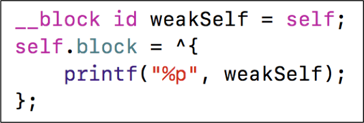
