# 1、OC对象的本质

## 1.1 OC底层实现

我们平时编写的Objective-C代码，底层实现其实都是C\C++代码。Objective-C的对象、类主要是基于C\C++的结构体实现。


## 1.2 将Objective-C代码转换为C\C++代码

>xcrun  -sdk  iphoneos  clang  -arch  arm64  -rewrite-objc  OC源文件  -o  输出的CPP文件。	
>如果需要链接其他框架，使用-framework参数。比如-framework UIKit

## 1.3 NSObject的底层实现


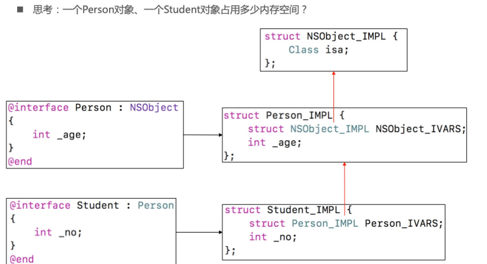

## 1.4 实时查看内存数据

### 1.4.1 ViewMemory


### 1.4.2 LLDB指令

>print、p：打印
>po：打印对象
>
>读取内存
>memory read/数量格式字节数  内存地址
>x/数量格式字节数  内存地址
>x/3xw  0x10010
>
>格式
>x是16进制
>f是浮点
>d是10进制
>
>字节大小
>b：byte 1字节
>h：half word 2字节
>w：word 4字节
>g：giant word 8字节
>
>修改内存中的值
>memory  write  内存地址  数值
>memory  write  0x0000010  10

## 1.5 结构体内存分配

[结构体大小计算](http://www.cnblogs.com/xieyajie/p/8094788.html)

## 1.6 sizeof注意点

sizeof是编译器特性，在编译的时候直接进行常理替换，并不是函数。class_getInstanceSize需要在运行时确定大小。

## 面试题

* 1.1一个NSObject对象占用多少内存？

```
 NSObject *obj = [[NSObject alloc] init];
// 16个字节
    
// 获得NSObject实例对象的成员变量所占用的大小 =8
NSLog(@"%zd", class_getInstanceSize([NSObject class]));//8
    
// 系统分配了16个字节给NSObject对象
//CF requires all objects be at least 16 bytes
NSLog(@"%zd", malloc_size((__bridge const void *)obj));//16

苹果系统分配内存源码
https://opensource.apple.com/tarballs/libmalloc/
malloc.c/calloc  Buckets sized {16,32,64,80,96,112,...}
操作系统分配内存也有对齐，16的整数倍

创建一个实例对象，至少需要多少内存？//结构体内存对齐
#import <objc/runtime.h>
class_getInstanceSize([NSObject class]);

建一个实例对象，实际上分配了多少内存？//操作系统分配内存也会对齐，16的整数倍
#import <malloc/malloc.h>
malloc_size((__bridge const void *)obj);

sizeof()也能计算出大小

gnu（glibc/malloc/MALLOC_ALIGNMENT=16 c语言源码）是一个开源组织也提供了相关源码

```

# 2、OC对象的分类
## 2.1 Objective-C中的对象，简称OC对象，主要可以分为3种

* instance对象（实例对象）
* class对象（类对象）
* meta-class对象（元类对象） 

### 2.1.1 instance

### 2.1.2 class

### 2.1.3 meta-class
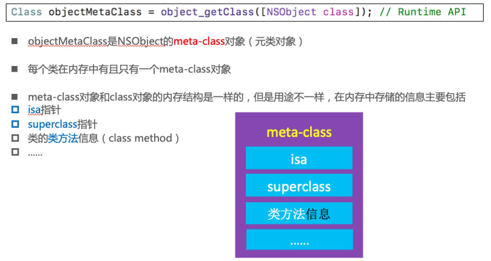

### 2.1.4 注意


### 2.1.5 查看Class是否为meta-class


## 2.2 object_getClass内部实现
https://opensource.apple.com/tarballs/	
objc4/objc-runtime.mm

```
/*
 1.Class objc_getClass(const char *aClassName)
 1> 传入字符串类名
 2> 返回对应的类对象
 
 2.Class object_getClass(id obj)
 1> 传入的obj可能是instance对象、class对象、meta-class对象
 2> 返回值
 a) 如果是instance对象，返回class对象
 b) 如果是class对象，返回meta-class对象
 c) 如果是meta-class对象，返回NSObject（基类）的meta-class对象
 
 3.- (Class)class、+ (Class)class
 1> 返回的就是类对象
 
 - (Class) {
     return self->isa;
 }
 
 + (Class) {
     return self;
 }
 */
```
## 2.3 isa指针


## 2.4 class对象的superclass指针

## 2.5 meta-class对象的superclass指
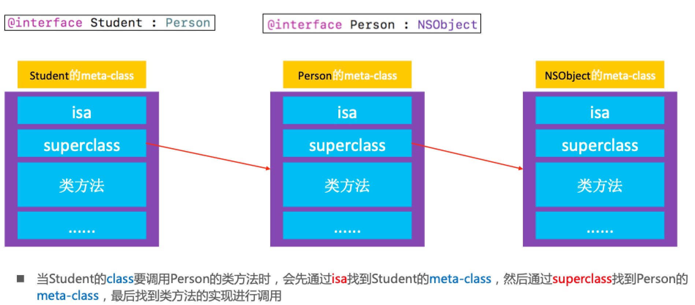
## 2.6 isa、superclass总结
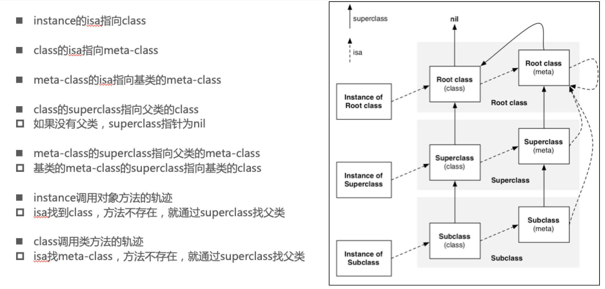
## 2.7 class结构体
### 2.7.1 isa指针
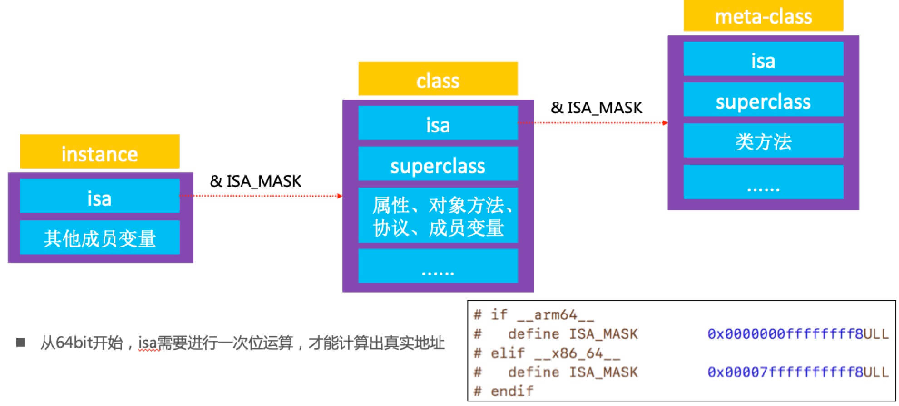

```
struct mj_objc_class {
    Class isa;
    Class superclass;
};

        // MJPerson类对象的地址：0x00000001000014c8
        // isa & ISA_MASK：0x00000001000014c8
        
        // MJPerson实例对象的isa：0x001d8001000014c9
        
        struct mj_objc_class *personClass = (__bridge struct mj_objc_class *)([MJPerson class]);
        
        struct mj_objc_class *studentClass = (__bridge struct mj_objc_class *)([MJStudent class]);
        
        NSLog(@"1111");
        
//        MJPerson *person = [[MJPerson alloc] init];
//
        
//        Class personClass = [MJPerson class];
        
//        struct mj_objc_class *personClass2 = (__bridge struct mj_objc_class *)(personClass);
//
//        Class personMetaClass = object_getClass(personClass);
//
//        NSLog(@"%p %p %p", person, personClass, personMetaClass);
//        MJStudent *student = [[MJStudent alloc] init];

```
```
64bit之前isa = 对象地址，从64bit开始，isa需要进行一次位运算，才能计算出真实地址	
p/x (long)person->isa
输出
0x001d8001000014c9

p/x persionClass 
输出
0x00000001000014c8

p/x 0x001d8001000014c9 & 0x00007ffffffffff8（x86下ISA_MASK）
输出
0x00000001000014c8

```
### 2.7.2 objc4源码下载
* https://opensource.apple.com/tarballs/objc4/
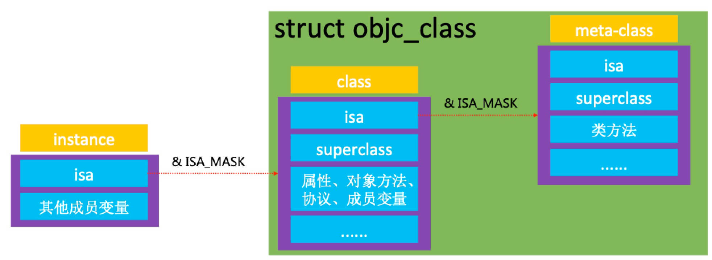
* class、meta-class对象的本质结构都是struct objc_class

### 2.7.3 窥探struct objc_class的结构


## 面试题 

* 对象的isa指针指向哪里？

```
instance对象的isa指向class对象
class对象的isa指向meta-class对象
meta-class对象的isa指向基类的meta-class对象
```

* OC的类信息存放在哪里？
  
```
对象方法、属性、成员变量、协议信息，存放在class对象中
类方法，存放在meta-class对象中
成员变量的具体值，存放在instance对象

```

# 3、KVO

>KVO的全称是Key-Value Observing，俗称“键值监听”，可以用于监听某个对象属性值的改变


```
@interface ViewController ()
@property (strong, nonatomic) MJPerson *person1;
@property (strong, nonatomic) MJPerson *person2;
@end

@implementation ViewController

- (void)viewDidLoad {
    [super viewDidLoad];
    
    self.person1 = [[MJPerson alloc] init];
    self.person1.age = 1;
    self.person1.height = 11;
    
    self.person2 = [[MJPerson alloc] init];
    self.person2.age = 2;
    self.person2.height = 22;
    
    // 给person1对象添加KVO监听
    NSKeyValueObservingOptions options = NSKeyValueObservingOptionNew | NSKeyValueObservingOptionOld;
    [self.person1 addObserver:self forKeyPath:@"age" options:options context:@"123"];
    [self.person1 addObserver:self forKeyPath:@"height" options:options context:@"456"];
}

- (void)touchesBegan:(NSSet<UITouch *> *)touches withEvent:(UIEvent *)event
{
    self.person1.age = 20;
    self.person2.age = 20;
    
    self.person1.height = 30;
    self.person2.height = 30;
}

- (void)dealloc {
    [self.person1 removeObserver:self forKeyPath:@"age"];
    [self.person1 removeObserver:self forKeyPath:@"height"];
}

// 当监听对象的属性值发生改变时，就会调用
- (void)observeValueForKeyPath:(NSString *)keyPath ofObject:(id)object change:(NSDictionary<NSKeyValueChangeKey,id> *)change context:(void *)context
{
    NSLog(@"监听到%@的%@属性值改变了 - %@ - %@", object, keyPath, change, context);
}

```

## 3.1 未使用KVO监听的对象

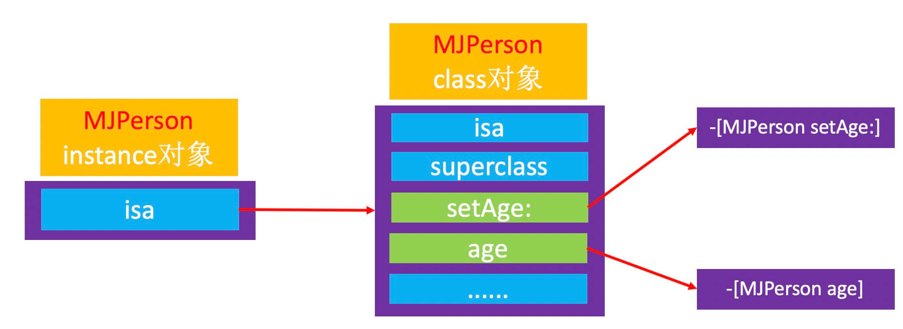

## 3.2 使用了KVO监听的对象


## 3.3 查看_NSSet*AndNotify的存在

```
@interface MJPerson : NSObject
@property (assign, nonatomic) int age;
@end

@implementation MJPerson

- (void)setAge:(int)age
{
    _age = age;
    
    NSLog(@"setAge:");
}

//- (int)age
//{
//    return _age;
//}

- (void)willChangeValueForKey:(NSString *)key
{
    [super willChangeValueForKey:key];
    
    NSLog(@"willChangeValueForKey");
}

- (void)didChangeValueForKey:(NSString *)key
{
    NSLog(@"didChangeValueForKey - begin");
    
    [super didChangeValueForKey:key];
    
    NSLog(@"didChangeValueForKey - end");
}

//ViewController
- (void)viewDidLoad {
    [super viewDidLoad];
    
    self.person1 = [[MJPerson alloc] init];
    self.person1.age = 1;
    
    self.person2 = [[MJPerson alloc] init];
    self.person2.age = 2;
    
    
//    NSLog(@"person1添加KVO监听之前1 - %@ %@",
//          object_getClass(self.person1),
//          object_getClass(self.person2));

//    NSLog(@"person1添加KVO监听之前2 - %p %p",
//          [self.person1 methodForSelector:@selector(setAge:)],
//          [self.person2 methodForSelector:@selector(setAge:)]);
    
    // 给person1对象添加KVO监听
    NSKeyValueObservingOptions options = NSKeyValueObservingOptionNew | NSKeyValueObservingOptionOld;
    [self.person1 addObserver:self forKeyPath:@"age" options:options context:@"123"];
    
//    NSLog(@"person1添加KVO监听之后1 - %@ %@",
//          object_getClass(self.person1),
//          object_getClass(self.person2));
//    NSLog(@"person1添加KVO监听之后2 - %p %p",
//          [self.person1 methodForSelector:@selector(setAge:)],
//          [self.person2 methodForSelector:@selector(setAge:)]);
//
//
//    NSLog(@"类对象 - %@ %@",
//          object_getClass(self.person1),  // self.person1.isa
//          object_getClass(self.person2)); // self.person2.isa
//    NSLog(@"类对象 - %p %p",
//          object_getClass(self.person1),  // self.person1.isa
//          object_getClass(self.person2)); // self.person2.isa
//
//    NSLog(@"元类对象 - %@ %@",
//          object_getClass(object_getClass(self.person1)), // self.person1.isa.isa
//          object_getClass(object_getClass(self.person2))); // self.person2.isa.isa
//    NSLog(@"元类对象 - %p %p",
//          object_getClass(object_getClass(self.person1)), // self.person1.isa.isa
//          object_getClass(object_getClass(self.person2))); // self.person2.isa.isa

//Log查看方法
persion1添加KVO监听之前2 - 0x1065687c0 0x1065687c0
persion1添加KVO监听之后2 - 0x1069189e4 0x1065687c0

p (IMP)0x1065687c0
(IMP) $0 0x00... (Interview01`-[MJPerson setAge:] at MJPerson.m13)

p (IMP)0x1069189e4
(IMP) $1 0x00... (Foundation`_NSSetIntValueAndNotify)
    
}

类对象 - NSKVONotifying_MJPerson MJPersion
元类对象 - NSKVONotifying_MJPerson MJPersion

- (void)touchesBegan:(NSSet<UITouch *> *)touches withEvent:(UIEvent *)event
{
    // NSKVONotifying_MJPerson是使用Runtime动态创建的一个类，是MJPerson的子类
    // self.person1.isa == NSKVONotifying_MJPerson
    [self.person1 setAge:21];
    
    // self.person2.isa = MJPerson
//    [self.person2 setAge:22];
}

- (void)dealloc {
    [self.person1 removeObserver:self forKeyPath:@"age"];
}

// 当监听对象的属性值发生改变时，就会调用
- (void)observeValueForKeyPath:(NSString *)keyPath ofObject:(id)object change:(NSDictionary<NSKeyValueChangeKey,id> *)change context:(void *)context
{
    NSLog(@"监听到%@的%@属性值改变了 - %@ - %@", object, keyPath, change, context);
}

```


## 3.4 _NSSet*ValueAndNotify的内部实现


```
调用willChangeValueForKey:
调用原来的setter实现
调用didChangeValueForKey:
didChangeValueForKey:内部会调用observer的observeValueForKeyPath:ofObject:change:context:方法
```

### 3.5 KVO子类的内部方法
 ```
 通过runtime获取方法类表。就知道有下面方法
 - (void)printMethodNamesOfClass:(Class)cls {
    unsigned int count;
    // 获得方法数组
    Method *methodList = class_copyMethodList(cls, &count);
    
    // 存储方法名
    NSMutableString *methodNames = [NSMutableString string];
    
    // 遍历所有的方法
    for (int i = 0; i < count; i++) {
        // 获得方法
        Method method = methodList[i];
        // 获得方法名
        NSString *methodName = NSStringFromSelector(method_getName(method));
        // 拼接方法名
        [methodNames appendString:methodName];
        [methodNames appendString:@", "];
    }
    
    // 释放
    free(methodList);
    
    // 打印方法名
    NSLog(@"%@ %@", cls, methodNames);
}

 @implementation NSKVONotifying_MJPerson

- (void)setAge:(int)age
{
    _NSSetIntValueAndNotify();
}

// 屏幕内部实现，隐藏了NSKVONotifying_MJPerson类的存在
- (Class)class
{
    return [MJPerson class];
}

- (void)dealloc
{
    // 收尾工作
}

- (BOOL)_isKVOA
{
    return YES;
}

@end
 ```

 ## 面试题
 
 * iOS用什么方式实现对一个对象的KVO？(KVO的本质是什么？)

```
利用RuntimeAPI动态生成一个子类，并且让instance对象的isa指向这个全新的子类
当修改instance对象的属性时，会调用Foundation的_NSSetXXXValueAndNotify函数
willChangeValueForKey:
父类原来的setter
didChangeValueForKey:
内部会触发监听器（Oberser）的监听方法( observeValueForKeyPath:ofObject:change:context:）
```

* 如何手动触发KVO？

```
手动调用willChangeValueForKey:和didChangeValueForKey:
```

* 直接修改成员变量会触发KVO么？

```
不会触发KVO
```

# 4、KVC

## 4.1 概述

>KVC的全称是Key-Value Coding，俗称“键值编码”，可以通过一个key来访问某个属性

常见的API有

```
- (void)setValue:(id)value forKeyPath:(NSString *)keyPath;
- (void)setValue:(id)value forKey:(NSString *)key;
- (id)valueForKeyPath:(NSString *)keyPath;
- (id)valueForKey:(NSString *)key;
```
## 4.2 setValue:forKey:的原理


* accessInstanceVariablesDirectly方法的默认返回值是YES


## 4.3 valueForKey:的原理


## 面试题

### 通过KVC修改属性会触发KVO么？

```
通过kvo监听某个属性，如果修改属性，会触发kvo，如果用 -> 直接修改成员变量，不会触发KVO。
如果通过kvc修改类的变量，不管是属性还是成员变量，只用通过kvo监听这个变量都很触发kvo。（即都很收到属性变化的通知）
kvo监听某个属性，系统通过runtime生成NSKVONotififying_XXX子类重写set方法。发通知（见上面kvo原理）
kvc在setValue:forKey/setValue:forKeyPath中调用willChangeValueForKey、didChangeValueForKey（必须成对出现，要不然不会发通知），在didChangeValueForKey中会发通知变量改变
```

### KVC的赋值和取值过程是怎样的？原理是什么？

# 5、Category

## 5.1 Category的底层结构

定义在objc-runtime-new.h中


## 5.2 Category的加载处理过程

1. 通过Runtime加载某个类的所有Category数据
2. 把所有Category的方法、属性、协议数据，合并到一个大数组中
后面参与编译的Category数据，会在数组的前面
3. 将合并后的分类数据（方法、属性、协议），插入到类原来数据的前面，多个分类最后面编译的分类添加在类原来数据的最前面。

>注意：通过runtime在运行时将分类的方法合并到类对象和元类对象中。

```
源码解读顺序
objc-os.mm
_objc_init
map_images
map_images_nolock

objc-runtime-new.mm
_read_images
remethodizeClass
attachCategories
attachLists
realloc、memmove、 memcpy

注意memmove、 memcpy
将4567 0、1位置的数据移到1、2位置

memmove流程：
4567->4557->4457（现将1位置移到2位置，再将0位置移动到1位置，数据在同一块区域。会判断高低位，保证数据完整性）
用于类中方法的移动。

memcpy流程
4567->4467->4447（现将0位置移到1位置，再将1位置移动到2位置，将分类中的信息追加到类中由于存放数据在不同的区域可以直接复制。）
用于将分类中方法的移动到类中。
```

原类添加分类原理图


如果找到方法之后就不会继续往下找了，其他分类和原类中的同名方法还在，但是不会被执行。
* 注意
1. 原类和分类中有同名的方法，会执行分类中的。
2. 原类中的同名方法还在，不会被执行。
3. 一个类的多个分类有同名的方法，会按照编译顺序，执行最后编译的那个分类的方法。(即Build Phases->Compile Sources最下方的分类中的同名方法)
4. 类扩展（在.m头部写的私有属性，方法）是在编译的时候合并到类中，分类是通过runtime在运行时合并到类中。

## 5.3 +load方法

* +load方法会在runtime加载类、分类时调用
* 每个类、分类的+load，在程序运行过程中只调用一次
* 调用顺序
    1. 先调用类的+load
        1. 按照编译先后顺序调用（先编译，先调用）
        2. 调用子类的+load之前会先调用父类的+load（如果父类中的load已经调过，只调用一次，不会再调）
    2. 再调用分类的+load
        1. 按照编译先后顺序调用（先编译，先调用）

```
objc4源码解读过程：
objc-os.mm
_objc_init

load_images

prepare_load_methods
schedule_class_load
add_class_to_loadable_list
add_category_to_loadable_list

call_load_methods
call_class_loads
call_category_loads
(*load_method)(cls, SEL_load)

struct loadable_category {
    Class cls;
    IMP method;
}

struct loadable_category {
    Class cls;
    IMP mehtod;
}
以上两个结构体中的method就是指向load方法。
```

* +load方法是根据方法地址直接调用，并不是经过objc_msgSend函数调用

## 5.4 +initialize方法

* +initialize方法会在类第一次接收到消息时调用
* 调用顺序
    1. 先调用父类的+initialize，再调用子类的+initialize
    2. (先初始化父类，再初始化子类，每个类只会初始化1次)

```
objc4源码解读过程
objc-msg-arm64.s
objc_msgSend

objc-runtime-new.mm
class_getInstanceMethod
lookUpImpOrNil
lookUpImpOrForward
_class_initialize
callInitialize
objc_msgSend(cls, SEL_initialize)

伪代码
if (自己没有初始化) {
    if (父类没有初始化) {
        objc_msgSend([父类 class], @selector(initialize));
        父类初始化了;
    }

    objc_msgSend([自己 class], @selector(initialize));
    自己初始化了;
}

```

* +initialize和+load的很大区别是，+initialize是通过objc_msgSend进行调用的，所以有以下特点:
    * 如果子类没有实现+initialize，会调用父类的+initialize（所以父类的+initialize可能会被调用多次）
    * 如果分类实现了+initialize，就覆盖类本身的+initialize调用

## 面试题

### 1、Category的实现原理

```
Category编译之后的底层结构是struct category_t，里面存储着分类的对象方法、类方法、属性、协议信息。     
在程序运行的时候，runtime会将Category的数据，合并到类信息中（类对象、元类对象中）
```

### 2、Category和Class Extension的区别是什么？

```
Class Extension在编译的时候，它的数据就已经包含在类信息中
Category是在运行时，才会将数据合并到类信息中
```

### 3、Category中有load方法吗？load方法是什么时候调用的？load 方法能继承吗？

```
有load方法
load方法在runtime加载类、分类的时候调用
load方法可以继承，但是一般情况下不会主动去调用load方法，都是让系统自动调用(系统自己调用load方法是直接通过函数地址调用，如果手动调用load，即[Class load]，则通过消息发送机制调用load方法。先根据isa找到元类对象，如果有就调用，没有就通过superclass在父类中查找。)
```

### 4、load、initialize方法的区别什么？它们在category中的调用的顺序？以及出现继承时他们之间的调用过程？

* load、initialize方法的区别是什么？
    * 调用方式
        * load是根据函数地址直接调用
        * initialize是通过objc_msgSend调用
    * 调用时机
        * load是runtime加载类、分类的时候调用（只会调用一次）
        * initialize是类第一次接收到消息的时候调用（在查找方法列表的时候，看类有没有初始化（先看父类有没有初始化，最后在看自己），没有初始化就发送initialize），每一个类只会调用一次，父类中的initialize方法可能会被调用多次。
* load、initialize的调用顺序？
    * load
        * 先调用类的load
            * 先编译的类，优先调用load
            * 调用子类的load之前，会先调用父类的load
        * 再调用分类的load
            * 先编译的分类，优先调用load
    * initialize
        * 先初始化父类
        * 再初始化子类（如果子类中没有实现initialize方法，调用父类中的initialize方法）


# 6、关联对象

## 6.1 如何实现给分类“添加成员变量”？

默认情况下，因为分类底层结构的限制，不能添加成员变量到分类中。但可以通过关联对象来间接实现
关联对象提供了以下API:
1. 添加关联对象

```
void objc_setAssociatedObject(id object, const void * key, id value, objc_AssociationPolicy policy)
```

2. 获得关联对象

```
id objc_getAssociatedObject(id object, const void * key
```

3. 移除所有的关联对象

```
void objc_removeAssociatedObjects(id object)
```

## 6.2 key的常见用

```
static (const) void *MyKey = &MyKey;
objc_setAssociatedObject(obj, MyKey, value, OBJC_ASSOCIATION_RETAIN_NONATOMIC)
objc_getAssociatedObject(obj, MyKey)

static (const) char MyKey;
objc_setAssociatedObject(obj, &MyKey, value, OBJC_ASSOCIATION_RETAIN_NONATOMIC)
objc_getAssociatedObject(obj, &MyKey)

使用属性名作为key（同一个常量地址相同）
objc_setAssociatedObject(obj, @"property", value, OBJC_ASSOCIATION_RETAIN_NONATOMIC);
objc_getAssociatedObject(obj, @"property");

使用get方法的@selecor作为key（或者_cmd（和@selector(方法名)等效）
objc_setAssociatedObject(obj, @selector(getter), value, OBJC_ASSOCIATION_RETAIN_NONATOMIC)
objc_getAssociatedObject(obj, @selector(getter))

注意：
加static是为了让外部无法通过extern访问。static限制作用域。
加const是为了和函数的参数类型一致，加不加都行。
```

## 6.3 objc_AssociationPolicy


* 注意：没有弱引用（weak）,弱引用相关用assign，如果访问已经释放了的对象，会造成崩溃（对象释放之后，weak会将指针置为nil，assign不会，会出现坏内存访问的崩溃）。
* 如果关联对象释放了，会将AssociationsHashMap中object对象对应的disguised_ptr_t和ObjectAssociationMap键值对移除。

## 6.4 关联对象的原理

实现关联对象技术的核心对象有

* AssociationsManager
* AssociationsHashMap
* ObjectAssociationMap
* ObjcAssociation

objc4源码解读：objc-references.mm


# 7、Block
## 7.1 block的本质

* block本质上也是一个OC对象，它内部也有个isa指针
* 是封装了函数调用以及函数调用环境的OC对象
* block的底层结构如图所示

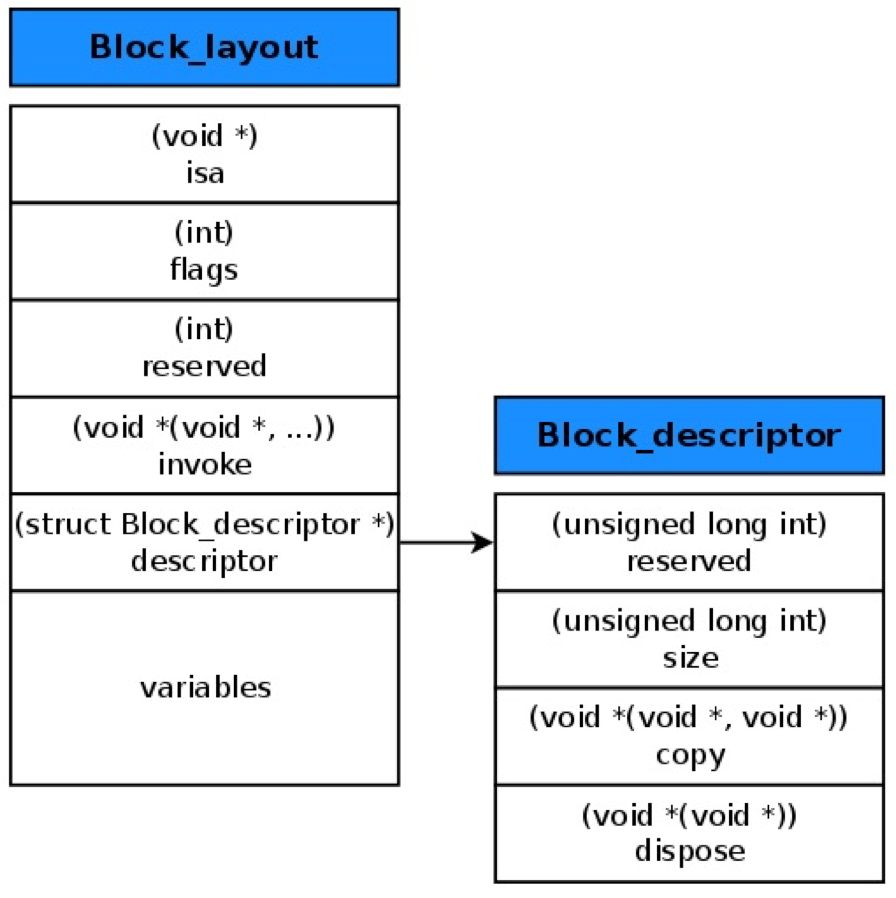

```
^{
    NSLog(@"this is a block");
};

执行
^{
    NSLog(@"this is a block");
}();

将block赋值给一个变量
void (^block)(void) = ^{
    NSLog(@"this is a block");
}
执行
block();


```

## 7.2 block的变量捕获（capture）

* 变量的分类
    * 局部变量
        * auto
        * static
        * register
    * 全局变量

* 为了保证block内部能够正常访问外部的变量，block有个变量捕获机制


* 局部变量block会捕获（由于局部变量作用域，可能访问的时候变量已经释放，所以需要在block中保存），全局变量block不会捕获。

* block会捕获self。（self是oc方法的默认参数，是局部变量，oc代码转成c++代码，方法转成函数都会带两个默认参数：Class *self，SEL _cmd）

* 属性、成员变量block会捕获self，需要通过self才能访问到（属性：self.name，成员变量self->_name）


```
main.m中block的简化执行代码：
// 定义block变量
int a = 10;
static b = 20;
void (*block)(void) = &__main_block_impl_0(
                                            __main_block_func_0,
                                            &__main_block_desc_0_DATA,
                                            a,
                                            &b
                                            );

// 执行block内部的代码
block->FuncPtr(block);

其中
//结构体名称__main为调用block的方法名
struct __main_block_impl_0 {
  struct __block_impl impl;
  struct __main_block_desc_0* Desc;
  int a;
  int *b;
  // 构造函数（类似于OC的init方法），返回结构体对象
  // a(_a) 将_a的值赋值给a
  __main_block_impl_0(void *fp, struct __main_block_desc_0 *desc,  int _a, int *_b, int flags=0) : a(_a), b(_b) {
    impl.isa = &_NSConcreteStackBlock;
    impl.Flags = flags;
    impl.FuncPtr = fp;
    Desc = desc;
  }
};

// 封装了block执行逻辑的函数
static void __main_block_func_0(struct __main_block_impl_0 *__cself) {
            int a = __cself->a; 
            int *b = __cself->b;
            
            NSLog((NSString *)&__NSConstantStringImpl__var_folders_2r__m13fp2x2n9dvlr8d68yry500000gn_T_main_fd2a14_mi_0, a, (*b));
        }

static struct __main_block_desc_0 {
  size_t reserved;
  size_t Block_size;
} __main_block_desc_0_DATA = { 0, sizeof(struct __main_block_impl_0)};
```

## 7.3 block的类型
block有3种类型，可以通过调用class方法或者isa指针查看具体类型，最终都是继承自NSBlock类型

```
__NSGlobalBlock__ : __NSGlobalBlock : NSBlock : NSObject(通过[block class],[[block class] superclass],[[[block class] superclass] superclass],[[[[block class] superclass] superclass] superclass]查看)

block的类型以运行时为准，clang转的只能作为参考
```

* __NSGlobalBlock__ （ _NSConcreteGlobalBlock ）
* __NSStackBlock__ （ _NSConcreteStackBlock ）
* __NSMallocBlock__ （ _NSConcreteMallocBlock ）

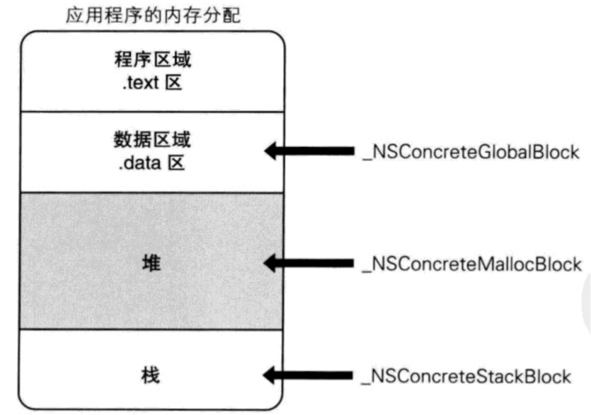

```
越往下内存地址越大

int a = 10;
- (void)test {
    int b = 20;
    NSObject *o = [[NSObject allock] init];

    NSLog(@"数据区域：a %p",&a);
    NSLog(@"栈：b %p",&b);
    NSLog(@"堆：o %p",o);

    //打印类对象存放地址，看看和哪个区域接近，就可猜测存放位置
    NSLog(@"未知区域：x %p",[NSObject class]);
}
```


```
ARC下block捕获auto变量仍是stackblock，会自动对block进行copy操作，要想观察block类型需要在MRC环境下。
如果block是StackBlock，离开作用域block会被释放，再访问block会出现未知的错误。
GlobalBlock、MallocBlock调用copy类型不变，StackBlock调用copy变成MallocBlock。
MRC下对block进行copy，需要调用release释放block。

- (void)test {
    int age = 10;
    void(^block)(void) = [^{
        NSLog(@"age is %d",age);
    } copy];

    [block release];
}
```

每一种类型的block调用copy后的结果如下所示


## 7.4 block的copy

在ARC环境下，编译器会根据情况自动将栈上的block复制到堆上，比如以下情况

* block作为函数返回值时
* 将block赋值给__strong指针时
* block作为Cocoa API中方法名含有usingBlock的方法参数时
* block作为GCD API的方法参数时

MRC下block属性的建议写法
```
@property (copy, nonatomic) void (^block)(void);
```

ARC下block属性的建议写法

```
@property (strong, nonatomic) void (^block)(void);
@property (copy, nonatomic) void (^block)(void);
```

## 7.5 对象类型的auto变量

当block内部访问了对象类型的auto变量时

* 如果block是在栈上，将不会对auto变量产生强引用
* 如果block被拷贝到堆上
    * 会调用block内部的copy函数
    * copy函数内部会调用_Block_object_assign函数
    * _Block_object_assign函数会根据auto变量的修饰符（__strong、__weak、__unsafe_unretained）做出相应的操作，形成强引用（retain）或者弱引用
* 如果block从堆上移除
    * 会调用block内部的dispose函数
    * dispose函数内部会调用_Block_object_dispose函数
    * _Block_object_dispose函数会自动释放引用的auto变量（release）


```
typedef void (^MJBlock)(void);

int main(int argc, const char * argv[]) {
    @autoreleasepool {
        MJBlock block;
        {
            MJPerson *person = [[MJPerson alloc] init];
            person.age = 10;
            
//            __weak MJPerson *weakPerson = person;
            int age = 10;
            block = ^{
                NSLog(@"---------%d", person.age);
            };
        }
        NSLog(@"------");
    }
    return 0;
}
转化成c++代码
int main(int argc, const char * argv[]) {
    /* @autoreleasepool */ { __AtAutoreleasePool __autoreleasepool; 
        MJBlock block;

        {
            MJPerson *person = ((MJPerson *(*)(id, SEL))(void *)objc_msgSend)((id)((MJPerson *(*)(id, SEL))(void *)objc_msgSend)((id)objc_getClass("MJPerson"), sel_registerName("alloc")), sel_registerName("init"));
            ((void (*)(id, SEL, int))(void *)objc_msgSend)((id)person, sel_registerName("setAge:"), 10);


            int age = 10;
            block = ((void (*)())&__main_block_impl_0((void *)__main_block_func_0, &__main_block_desc_0_DATA, person, 570425344));
        }

        NSLog((NSString *)&__NSConstantStringImpl__var_folders_2r__m13fp2x2n9dvlr8d68yry500000gn_T_main_c41e64_mi_1);
    }
    return 0;
}

struct __main_block_impl_0 {
  struct __block_impl impl;
  struct __main_block_desc_0* Desc;
  MJPerson *__strong person;
  __main_block_impl_0(void *fp, struct __main_block_desc_0 *desc, MJPerson *__strong _person, int flags=0) : person(_person) {
    impl.isa = &_NSConcreteStackBlock;
    impl.Flags = flags;
    impl.FuncPtr = fp;
    Desc = desc;
  }
};

struct __block_impl {
  void *isa;
  int Flags;
  int Reserved;
  void *FuncPtr;
};

static struct __main_block_desc_0 {
  size_t reserved;
  size_t Block_size;
  void (*copy)(struct __main_block_impl_0*, struct __main_block_impl_0*);
  void (*dispose)(struct __main_block_impl_0*);
} __main_block_desc_0_DATA = { 0, sizeof(struct __main_block_impl_0), __main_block_copy_0, __main_block_dispose_0};

static void __main_block_copy_0(struct __main_block_impl_0*dst, struct __main_block_impl_0*src) {_Block_object_assign((void*)&dst->person, (void*)src->person, 3/*BLOCK_FIELD_IS_OBJECT*/);}

static void __main_block_dispose_0(struct __main_block_impl_0*src) {_Block_object_dispose((void*)src->person, 3/*BLOCK_FIELD_IS_OBJECT*/);}

static void __main_block_func_0(struct __main_block_impl_0 *__cself) {
  MJPerson *__strong person = __cself->person; // bound by copy

                NSLog((NSString *)&__NSConstantStringImpl__var_folders_2r__m13fp2x2n9dvlr8d68yry500000gn_T_main_c41e64_mi_0, ((int (*)(id, SEL))(void *)objc_msgSend)((id)person, sel_registerName("age")));
            }

```


## 7.6 __weak问题解决

在使用clang转换OC为C++代码时，可能会遇到以下问题

>cannot create __weak reference in file using manual reference

解决方案：支持ARC、指定运行时系统版本，比如

>xcrun -sdk iphoneos clang -arch arm64 -rewrite-objc -fobjc-arc -fobjc-runtime=ios-8.0.0 main.m

## 7.7 __block修饰符


* 注意 只有在需要修改auto变量的时候再添加__block。尽量不要使用，加了之后编译的代码复杂。

```
typedef void (^MJBlock)(void);

int main(int argc, const char * argv[]) {
    @autoreleasepool {
        
        __block int age = 10;
        
        MJBlock block = ^{
            age = 20;
            NSLog(@"age is %d", age);
        };

        /*
        NSLog(@"age的地址 %p",&age);
        __block int age底层转换成struct __Block_byref_age_0 age。
        这个age的地址是struct __Block_byref_age_0中成员变量age的地址而不是，结构体的地址
        隐藏的底层实现。

        struct __main_block_impl_0 *blockImpl = (__bridge struct __main_block_impl_0 *)block;

        p/x blockImpl->age
        p/x blockImpl->age->age
        （将block转成结构体，打印地址对比可知）
        */
        
        block();
    }
    return 0;
}

转成c++
int main(int argc, const char * argv[]) {
    /* @autoreleasepool */ { __AtAutoreleasePool __autoreleasepool; 

        __attribute__((__blocks__(byref))) __Block_byref_age_0 age = {
            (void*)0,
            (__Block_byref_age_0 *)&age,
             0, 
             sizeof(__Block_byref_age_0), 
             10
             };

        MJBlock block = ((void (*)())&__main_block_impl_0(
            (void *)__main_block_func_0, 
            &__main_block_desc_0_DATA, 
            (__Block_byref_age_0 *)&age, 
            570425344//flag
            ));

        ((void (*)(__block_impl *))((__block_impl *)block)->FuncPtr)((__block_impl *)block);

    }
    return 0;
}

struct __main_block_impl_0 {
  struct __block_impl impl;
  struct __main_block_desc_0* Desc;
  __Block_byref_age_0 *age; // by ref
  __main_block_impl_0(void *fp, struct __main_block_desc_0 *desc, __Block_byref_age_0 *_age, int flags=0) : age(_age->__forwarding) {
    impl.isa = &_NSConcreteStackBlock;
    impl.Flags = flags;
    impl.FuncPtr = fp;
    Desc = desc;
  }
};

struct __block_impl {
  void *isa;
  int Flags;
  int Reserved;
  void *FuncPtr;
};

static struct __main_block_desc_0 {
  size_t reserved;
  size_t Block_size;
  void (*copy)(struct __main_block_impl_0*, struct __main_block_impl_0*);
  void (*dispose)(struct __main_block_impl_0*);
} __main_block_desc_0_DATA = { 0, sizeof(struct __main_block_impl_0), __main_block_copy_0, __main_block_dispose_0};

static void __main_block_copy_0(struct __main_block_impl_0*dst, struct __main_block_impl_0*src) {_Block_object_assign((void*)&dst->age, (void*)src->age, 8/*BLOCK_FIELD_IS_BYREF*/);}

static void __main_block_dispose_0(struct __main_block_impl_0*src) {_Block_object_dispose((void*)src->age, 8/*BLOCK_FIELD_IS_BYREF*/);}

static void __main_block_func_0(struct __main_block_impl_0 *__cself) {
  __Block_byref_age_0 *age = __cself->age; // bound by ref

            (age->__forwarding->age) = 20;
            NSLog((NSString *)&__NSConstantStringImpl__var_folders_wy_w7fw9cz93q584fpvsjv4g2z00000gn_T_main_43afa8_mi_0, (age->__forwarding->age));
        }

struct __Block_byref_age_0 {
  void *__isa;
__Block_byref_age_0 *__forwarding;
 int __flags;
 int __size;
 int age;
};
```

## 7.8 __block的内存管理

* 当block在栈上时，并不会对__block变量产生强引用
* 当block被copy到堆时
    * 会调用block内部的copy函数
    * copy函数内部会调用_Block_object_assign函数
    * _Block_object_assign函数会对__block变量形成强引用（retain）


* 当block从堆中移除时
    * 会调用block内部的dispose函数
    * dispose函数内部会调用_Block_object_dispose函数
    * _Block_object_dispose函数会自动释放引用的__block变量（release)


## 7.9 __block的__forwarding指针

如果栈上的block进行copy会复制到堆上，同时将引用的__block变量复制到堆上，__forwarding指针，保证不管访问堆、栈哪个__block变量，最终修改的都是堆上的__block变量。

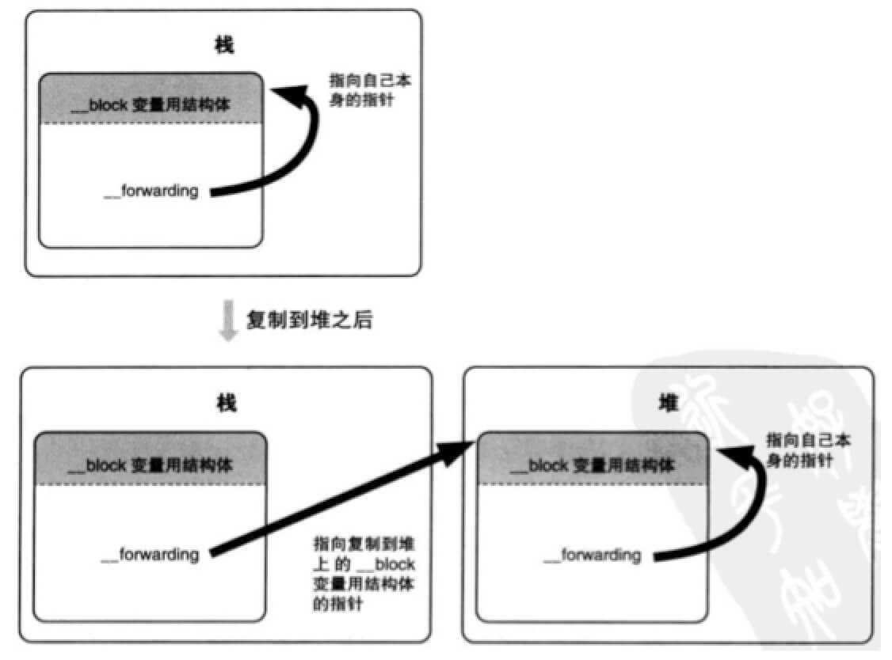

## 7.10 对象类型的auto变量、__block变量
* 当block在栈上时，对它们都不会产生强引用
* 当block拷贝到堆上时，都会通过copy函数来处理它们

```
__block变量（假设变量名叫做a）
_Block_object_assign((void*)&dst->a, (void*)src->a, 8/*BLOCK_FIELD_IS_BYREF*/);

对象类型的auto变量（假设变量名叫做p）
_Block_object_assign((void*)&dst->p, (void*)src->p, 3/*BLOCK_FIELD_IS_OBJECT*/);
```

* 当block从堆上移除时，都会通过dispose函数来释放它们

```
__block变量（假设变量名叫做a）
_Block_object_dispose((void*)src->a, 8/*BLOCK_FIELD_IS_BYREF*/);

对象类型的auto变量（假设变量名叫做p）
_Block_object_dispose((void*)src->p, 3/*BLOCK_FIELD_IS_OBJECT*/);
```

* 区别

```
block在堆上
对象类型的auto变量，会根据__strong/__weak _Block_object_assign决定是强引用还是弱引用。
__block变量，_Block_object_assign都是强引用。
```


## 7.11 被__block修饰的对象类型

* 当__block变量在栈上时，不会对指向的对象产生强引用
* 当__block变量被copy到堆时
    * 会调用__block变量内部的copy函数
    * copy函数内部会调用_Block_object_assign函数
    * _Block_object_assign函数会根据所指向对象的修饰符（__strong、__weak、__unsafe_unretained）做出相应的操作，形成强引用（retain）或者弱引用（注意：这里仅限于ARC时会retain，MRC时不会retain）
* 如果__block变量从堆上移除
    * 会调用__block变量内部的dispose函数
    * dispose函数内部会调用_Block_object_dispose函数
    * _Block_object_dispose函数会自动释放指向的对象（release）

## 7.12 循环引用问题

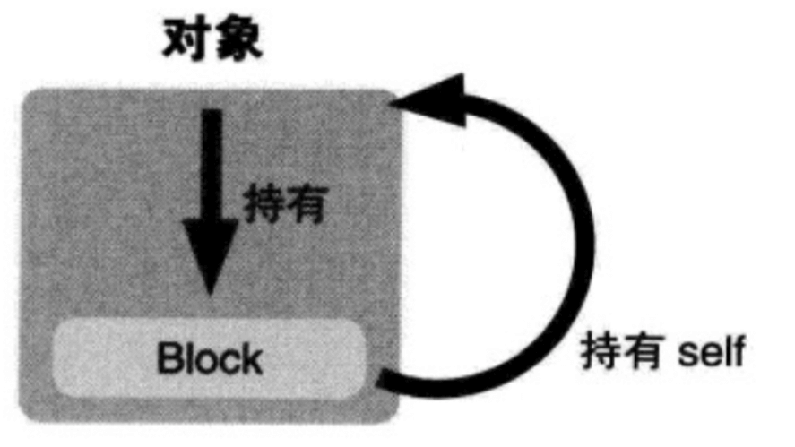

```
__weak typeof(self) weakSelf = self;
self.block = ^{
    __strong typeof(weakSelf) strongSelf = weakSelf;
    NSLog(@"age is %d",strongSelf.age);
}
加了__weak变量可能会在block调用之前已经释放，block内部是弱引用，可能无法访问到，需要用__strong保证weak变量在funcPtr未执行之前不会被释放。__strong也不是必须要加，如果weakself在block调用之前不会被释放，可以不加，加了也没问题。
```

### 7.12.1 解决循环引用问题 - ARC

* 用__weak、__unsafe_unretained解决


* 用__block解决（必须要调用block）


### 7.12.2 解决循环引用问题 - MRC

* 用__unsafe_unretained解决


* 用__block解决


## 面试题

### 1、block的原理是怎样的？本质是什么？

```
封装了函数调用以及调用环境的OC对象
```

### 2、__block的作用是什么？有什么使用注意点？

### 3、block的属性修饰词为什么是copy？使用block有哪些使用注意？

```
block一旦没有进行copy操作，就不会在堆上
使用注意：循环引用问题
```

### 4、block在修改NSMutableArray，需不需要添加__block？

```
__block是为了解决无法修改auto变量的问题。如果在block内部只是使用arr，比如添加元素，是不需要添加__block的，如果是block内重新生成一个NSArray，并赋值给block之前的auto变量，这个auto变量需要添加__block。
```

# 8、Runtime
* Objective-C是一门动态性比较强的编程语言，跟C、C++等语言有着很大的不同
* Objective-C的动态性是由Runtime API来支撑的
* Runtime API提供的接口基本都是C语言的，源码由C\C++\汇编语言编写

## 8.1 isa详解

### 8.1.1 isa简介

* 要想学习Runtime，首先要了解它底层的一些常用数据结构，比如isa指针
* 在arm64架构之前，isa就是一个普通的指针，存储着Class、Meta-Class对象的内存地址
* 从arm64架构开始，对isa进行了优化，变成了一个共用体（union）结构，还使用位域来存储更多的信息。需要用isa & ISA_MASK才能找到类，元类。


为了达到节省空间的目的，可以通过以下方式。

* 用位运算，一个char可以存储8个bool变量。

```
@interface MJPerson : NSObject
//@property (assign, nonatomic, getter=isTall) BOOL tall;
//@property (assign, nonatomic, getter=isRich) BOOL rich;
//@property (assign, nonatomic, getter=isHansome) BOOL handsome;

- (void)setTall:(BOOL)tall;
- (void)setRich:(BOOL)rich;
- (void)setHandsome:(BOOL)handsome;

- (BOOL)isTall;
- (BOOL)isRich;
- (BOOL)isHandsome;

@end

// &可以用来取出特定的位

// 0000 0111
//&0000 0100
//------
// 0000 0100

// 掩码，一般用来按位与(&)运算的
//#define MJTallMask 1
//#define MJRichMask 2
//#define MJHandsomeMask 4

//#define MJTallMask 0b00000001
//#define MJRichMask 0b00000010
//#define MJHandsomeMask 0b00000100

//用位移运算符优化的掩码
#define MJTallMask (1<<0)
#define MJRichMask (1<<1)
#define MJHandsomeMask (1<<2)

@interface MJPerson()
{
    char _tallRichHansome;
}
@end

@implementation MJPerson


// 0010 1010
//&1111 1101
//----------
// 0010 1000

- (instancetype)init
{
    if (self = [super init]) {
        _tallRichHansome = 0b00000100;
    }
    return self;
}

- (void)setTall:(BOOL)tall
{
    if (tall) {
        //如果某位想设置为1只需要将该位|1，这位设置成1。
        _tallRichHansome |= MJTallMask;
    } else {
        //如果某位想设置为0只需要将该位&0，这位设置成0。~为按位取反。
        _tallRichHansome &= ~MJTallMask;
    }
}

/*
把用的那一位用 &1 取出
只要&出有值，肯定不为0
!(_tallRichHansome & MJTallMask)将char转成bool，取反。
!！(_tallRichHansome & MJTallMask)为转换成相应的bool值。
**/

- (BOOL)isTall
{
    return !!(_tallRichHansome & MJTallMask);
}

- (void)setRich:(BOOL)rich
{
    if (rich) {
        _tallRichHansome |= MJRichMask;
    } else {
        _tallRichHansome &= ~MJRichMask;
    }
}

- (BOOL)isRich
{
    return !!(_tallRichHansome & MJRichMask);
}

- (void)setHandsome:(BOOL)handsome
{
    if (handsome) {
        _tallRichHansome |= MJHandsomeMask;
    } else {
        _tallRichHansome &= ~MJHandsomeMask;
    }
}

- (BOOL)isHandsome
{
    return !!(_tallRichHansome & MJHandsomeMask);
}

@end
```

* 位域

```
@interface MJPerson : NSObject
- (void)setTall:(BOOL)tall;
- (void)setRich:(BOOL)rich;
- (void)setHandsome:(BOOL)handsome;

- (BOOL)isTall;
- (BOOL)isRich;
- (BOOL)isHandsome;
@end

@interface MJPerson()
{
    // 位域
    struct {
        char tall : 1;
        char rich : 1;
        char handsome : 1;
    } _tallRichHandsome;
    /* 
    0b00000000 tall为右边第一位，rich为右边第二位，handsome为右边第三位。
    char tall : 2;
    char rich : 2;
    char handsome : 2;
    如果都改成2，则isTall可改为
    - (BOOL)isTall
    {
        return _tallRichHandsome.tall;
    }
    如果 char tall : 1;像上面那样写，会将最后一位填充到前面变成0b1111 1111 为-1。char tall : 2；两位表示bool 用0b01的高位0填充变成 0b0000 0001为yes。
    **/
}
@end

@implementation MJPerson

- (void)setTall:(BOOL)tall
{
    _tallRichHandsome.tall = tall;
}

- (BOOL)isTall
{
    //将char转成bool
    return !!_tallRichHandsome.tall;
}

- (void)setRich:(BOOL)rich
{
    _tallRichHandsome.rich = rich;
}

- (BOOL)isRich
{
    return !!_tallRichHandsome.rich;
}

- (void)setHandsome:(BOOL)handsome
{
    _tallRichHandsome.handsome = handsome;
}

- (BOOL)isHandsome
{
    return !!_tallRichHandsome.handsome;
}

int main () {
      MJPerson *person = [[MJPerson alloc] init];
        person.rich = YES;
        person.tall = NO;
        person.handsome = NO;
        
        NSLog(@"tall:%d rich:%d hansome:%d", person.isTall, person.isRich, person.isHandsome);
}
lldb
p/x persion->_tallRichHandsome
p/x &(persion->_tallRichHandsome)
x 上面的地址

* 共用体

#import <Foundation/Foundation.h>
@interface MJPerson : NSObject
- (void)setTall:(BOOL)tall;
- (void)setRich:(BOOL)rich;
- (void)setHandsome:(BOOL)handsome;
- (void)setThin:(BOOL)thin;

- (BOOL)isTall;
- (BOOL)isRich;
- (BOOL)isHandsome;
- (BOOL)isThin;
@end

#import "MJPerson.h"

#define MJTallMask (1<<0)
#define MJRichMask (1<<1)
#define MJHandsomeMask (1<<2)
#define MJThinMask (1<<3)

@interface MJPerson()
{
    //共用体，共用一块内存。（bits和_tallRichHandsome共用一块内存）
    union {
        char bits;
        //和第一种方式相同。结构体只是为了增加代码的可读性，可以删除。
        //如果结构体的大小大于8bit，则bits需要改为更长的类型，如int。以免越界丢失
        struct {
            char tall : 1;
            char rich : 1;
            char handsome : 1;
            char thin : 1;
        };
    } _tallRichHandsome;
}
@end

@implementation MJPerson

- (void)setTall:(BOOL)tall
{
    if (tall) {
        _tallRichHandsome.bits |= MJTallMask;
    } else {
        _tallRichHandsome.bits &= ~MJTallMask;
    }
}

- (BOOL)isTall
{
    return !!(_tallRichHandsome.bits & MJTallMask);
}

- (void)setRich:(BOOL)rich
{
    if (rich) {
        _tallRichHandsome.bits |= MJRichMask;
    } else {
        _tallRichHandsome.bits &= ~MJRichMask;
    }
}

- (BOOL)isRich
{
    return !!(_tallRichHandsome.bits & MJRichMask);
}

- (void)setHandsome:(BOOL)handsome
{
    if (handsome) {
        _tallRichHandsome.bits |= MJHandsomeMask;
    } else {
        _tallRichHandsome.bits &= ~MJHandsomeMask;
    }
}

- (BOOL)isHandsome
{
    return !!(_tallRichHandsome.bits & MJHandsomeMask);
}

- (void)setThin:(BOOL)thin
{
    if (thin) {
        _tallRichHandsome.bits |= MJThinMask;
    } else {
        _tallRichHandsome.bits &= ~MJThinMask;
    }
}

- (BOOL)isThin
{
    return !!(_tallRichHandsome.bits & MJThinMask);
}

@end

* 相关技术点，NS_OPTIONS枚举实现原理

```
typedef enum {
    MJOptionsOne = 1 << 0,
    MJOptionsTwo = 1 << 1,
    MJOptionsThree = 1 << 2,
    MJOptionsFour = 1 << 3,
} MJOptions;

- (int)main {
    [self setOptions:MJOptionsOne | MJOptionsTwo | MJOptionsThree | MJOptionsFour];
}

- (void)setOptions:(MJOptions)options {
    if (options & MJOptionsOne) {
        NSLog(@"包含MJOptionsOne");
    }
    if (options & MJOptionsTwo) {
        NSLog(@"包含MJOptionsTwo");
    }
    if (options & MJOptionsThree) {
        NSLog(@"包含MJOptionsThree");
    }
    if (options & MJOptionsFour) {
        NSLog(@"包含MJOptionsFour");
    }
}
```

```

### 8.1.2 isa位域

p/x obj->isa可以查看每一位

* nonpointer
    * 0，代表普通的指针，存储着Class、Meta-Class对象的内存地址
    * 1，代表优化过，使用位域存储更多的信息
* has_assoc
    * 是否有设置过关联对象，如果没有，释放时会更快，如果有需要先移除关联对象。（objc-runtime-new.mm中objc_destructInstance函数中有源码）
* has_cxx_dtor
    * 是否有C++的析构函数（.cxx_destruct），如果没有，释放时会更快，如果有，需要先调用析构函数。（objc-runtime-new.mm中objc_destructInstance函数中有源码）
* shiftcls
    * 存储着Class、Meta-Class对象的内存地址信息
    * Class、Meta-Class对象的内存地址值最后三位永远是0（shiftcls右边有上面三位的信息，&ISA_MASK后三位为0，使用位域，先用的是最右边的位）
* magic
    * 用于在调试时分辨对象是否未完成初始化
* weakly_referenced
    * 是否有被弱引用指向过，如果没有，释放时会更快
* deallocating
    * 对象是否正在释放
* extra_rc
    * 里面存储的值是引用计数器减1
* has_sidetable_rc
    * 引用计数器是否过大无法存储在isa中
    * 如果为1，那么引用计数会存储在一个叫SideTable的类的属性中

## 8.2 Class

### 8.2.1 Class的结构


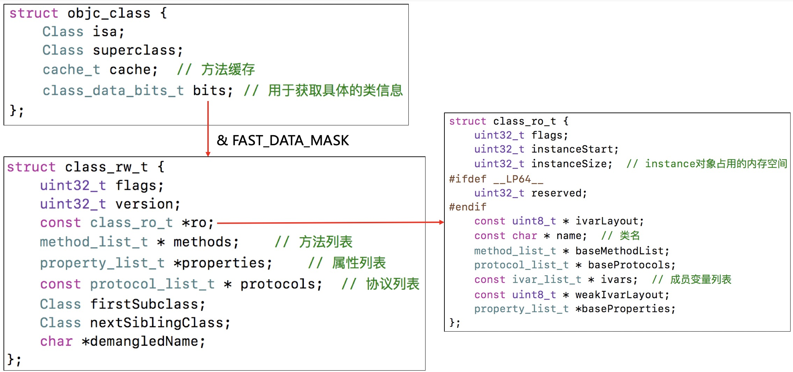

[MJClassInfo.h](project/MJClassInfo.h)

* bits和isa相似，存储了很多信息。
* MJClassInfo为了方便理解进行了简化，methods等是一维数组，真实类型为下面的二维数组。


### 8.2.2 class_rw_t

* class_rw_t里面的methods、properties、protocols是二维数组，是可读可写的，包含了类的初始内容、分类的内容。可以动态添加分类。


### 8.2.3 class_ro_t

* class_ro_t里面的baseMethodList、baseProtocols、ivars、baseProperties是一维数组，是只读的，包含了类的初始内容


### 8.2.4 method_t


### 8.2.5 Type Encoding

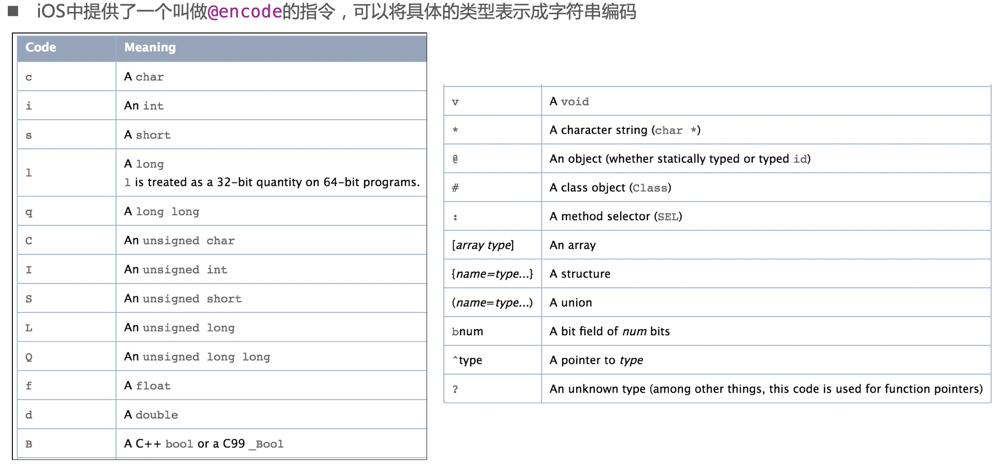

```
NSLog(@"%s", @encode(int));//输出 i 表示int
NSLog(@"%s", @encode(id));//输出 @ 表示 an obj or id type

/*
 "i24@0:8i16f20"
 "i 24 @ 0 : 8 i 16 f 20"
 i表示返回类型int，24 所有参数是字节数，@表示self，0表示重0开始，:表示参数 _cmd，8表示起始位置，i表示age的参数类型int，16表示起始位置，f表示height的参数类型float，20表示起始位置。
 **/
- (int)test:(int)age height:(float)height;
```

### 8.2.6 方法缓存

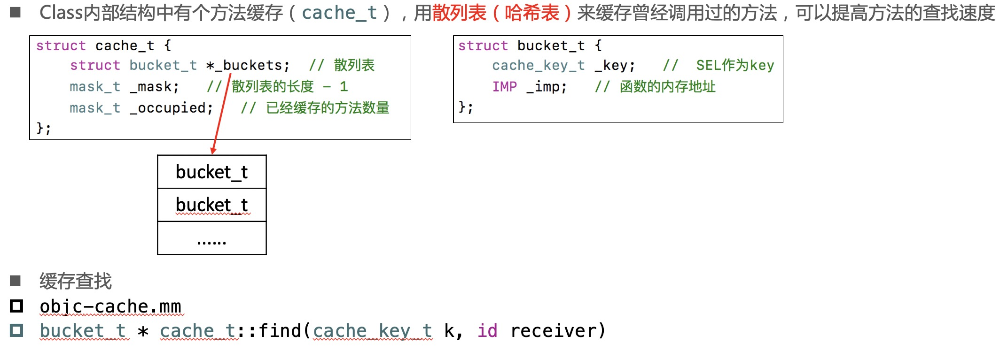


* @selector(selName) & _mask <= _mask,所以_mask为散列表的长度-1，（下标从0开始）
* 算法详情见MJClassInfo.h中cache_t结构体的方法 IMP imp(SEL selector)中的实现。如果一直没有找到合适的index。会将_buckets清空，将_mask翻倍，重新进行缓存计算。
* 通过MJClassInfo.h查看Cache_t

```
MJClassInfo.h为c++代码。使用步骤
1、将MJClassInfo.h添加到工程中。
2、将用到的类的.m修改成.mm。（为了支持c++语法）
3、强制转换类型
MJPerson *person = [[MJPerson alloc] init];
mj_objc_class *personClass = (__bridge mj_objc_class *)[MJPerson class];
[person test1];
[person test2];
[person test3];
[person test4];
4、打断点，每调用一个方法，查看personClass结构。cache数组只能显示第一个位置的信息，有可能为空。计算出来的index可能不是第0个位置。
如果想查看cache数据的所有数据。
bucket_t *buckets = cache._buckets;

//bucket_t bucket = buckets[(long long)@selector(studentTest) & cache._mask];
//NSLog(@"%s %p", bucket._key, bucket._imp);
//有可能第一次算出来的index不是我们想取的方法。调用MJClassInfo.h中cache_t结构体的方法 IMP imp(SEL selector)能保证取出来的index是想要的。
        
for (int i = 0; i <= cache._mask; i++) {
    bucket_t bucket = buckets[i];
    NSLog(@"%s %p", bucket._key, bucket._imp);
}

lldb
//可以查看方法。
p (IMP)(上面log出来的imp地址)
(lldb)p (IMP)0x100000e00 
(IMP) $0 = 0x100000e00 (Interview01-cache`-[MJPerson personTest] at MJPerson.m:12)
//Interview01-cache为工程名，-[MJPerson personTest] at MJPerson.m:12，方法位置。
```

## 8.3 objc_msgSend

>sel_registerName("test")等价于@selector(test)
>c语言转汇编会在方法名称前加一个_

### 8.3.1 执行流程

* OC中的方法调用，其实都是转换为objc_msgSend函数的调用
* objc_msgSend的执行流程可以分为3大阶段
  * 消息发送
  * 动态方法解析
  * 消息转发

### 8.3.2 源码跟读

* objc-msg-arm64.s
  * ENTRY _objc_msgSend
  * b.le	LNilOrTagged
  * CacheLookup NORMAL
  * .macro CacheLookup
  * .macro CheckMiss
  * STATIC_ENTRY __objc_msgSend_uncached
  * .macro MethodTableLookup
  * __class_lookupMethodAndLoadCache3

* objc-runtime-new.mm
  * _class_lookupMethodAndLoadCache3
  * lookUpImpOrForward
  * getMethodNoSuper_nolock、search_method_list、log_and_fill_cache
  * cache_getImp、log_and_fill_cache、getMethodNoSuper_nolock、log_and_fill_cache
  * _class_resolveInstanceMethod
  * _objc_msgForward_impcache

* objc-msg-arm64.s
  * STATIC_ENTRY __objc_msgForward_impcache
  * ENTRY __objc_msgForward

* Core Foundation
  * \_\_forwarding__（不开源）

### 8.3.3 消息发送


### 8.3.4 动态方法解析


* 动态添加方法


```
@interface MJPerson : NSObject
//- (void)test;
+ (void)test;
@end

#import "MJPerson.h"
#import <objc/runtime.h>

@implementation MJPerson

//void c_other(id self, SEL _cmd)
//{
//    NSLog(@"c_other - %@ - %@", self, NSStringFromSelector(_cmd));
//}
//
//+ (BOOL)resolveClassMethod:(SEL)sel
//{
//    if (sel == @selector(test)) {
//        // 第一个参数是object_getClass(self)
//        class_addMethod(object_getClass(self), sel, (IMP)c_other, "v16@0:8");
//        return YES;
//    }
//    return [super resolveClassMethod:sel];
//}

//+ (BOOL)resolveInstanceMethod:(SEL)sel
//{
//    if (sel == @selector(test)) {
//        // 动态添加test方法的实现
//        class_addMethod(self, sel, (IMP)c_other, "v16@0:8");
//
//        // 返回YES代表有动态添加方法
//        return YES;
//    }
//    return [super resolveInstanceMethod:sel];
//}

//- (void)other
//{
//    NSLog(@"%s", __func__);
//}
//
//+ (BOOL)resolveInstanceMethod:(SEL)sel
//{
//    if (sel == @selector(test)) {
//        // 获取其他方法
//        Method method = class_getInstanceMethod(self, @selector(other));
//
//        // 动态添加test方法的实现
//        class_addMethod(self, sel,
//                        method_getImplementation(method),
//                        method_getTypeEncoding(method));
//
//        // 返回YES代表有动态添加方法
//        return YES;
//    }
//    return [super resolveInstanceMethod:sel];
//}

// typedef struct objc_method *Method;
// struct objc_method == struct method_t
//        struct method_t *otherMethod = (struct method_t *)class_getInstanceMethod(self, @selector(other));

struct method_t {
    SEL sel;
    char *types;
    IMP imp;
};

//+ (BOOL)resolveInstanceMethod:(SEL)sel
//{
//    if (sel == @selector(test)) {
//        // 获取其他方法
//        struct method_t *method = (struct method_t *)class_getInstanceMethod(self, @selector(other));
//
//        // 动态添加test方法的实现
//        class_addMethod(self, sel, method->imp, method->types);
//
//        // 返回YES代表有动态添加方法
//        return YES;
//    }
//    return [super resolveInstanceMethod:sel];
//}
```

### 8.3.5 消息转发

来到消息转发会调用函数\_\_forwarding__，内部会调用下图中的方法，\_\_forwarding__未开源，国外根据汇编写的伪代码如下
原版
[\_\_forwarding__.c](project/__forwarding__.c)
删除部分逻辑的精简版
[\_\_forwarding__clean.c](project/__forwarding__clean.c)


* 生成NSMethodSignature


```
@interface MJPerson : NSObject
- (void)test;
@end
#import "MJPerson.h"
#import <objc/runtime.h>
#import "MJCat.h"

@implementation MJPerson

//- (id)forwardingTargetForSelector:(SEL)aSelector
//{
//    if (aSelector == @selector(test)) {
//        // objc_msgSend([[MJCat alloc] init], aSelector)
//        return [[MJCat alloc] init];
//    }
//    return [super forwardingTargetForSelector:aSelector];
//}

// 方法签名：返回值类型、参数类型
//- (NSMethodSignature *)methodSignatureForSelector:(SEL)aSelector
//{
//    if (aSelector == @selector(test)) {
//        return [NSMethodSignature signatureWithObjCTypes:"v16@0:8"];
//    }
//    return [super methodSignatureForSelector:aSelector];
//}

// NSInvocation封装了一个方法调用，包括：方法调用者、方法名、方法参数
//    anInvocation.target 方法调用者
//    anInvocation.selector 方法名
//    [anInvocation getArgument:NULL atIndex:0]
//- (void)forwardInvocation:(NSInvocation *)anInvocation
//{
////    anInvocation.target = [[MJCat alloc] init];
////    [anInvocation invoke];
//
//    [anInvocation invokeWithTarget:[[MJCat alloc] init]];
//}

@end

@interface MJCat : NSObject
- (void)test;
@end

#import "MJCat.h"

@implementation MJCat
- (void)test
{
    NSLog(@"%s", __func__);
}
@end
```

```
@interface MJPerson : NSObject
- (int)test:(int)age;
@end

#import <objc/runtime.h>
#import "MJCat.h"

@implementation MJPerson

- (NSMethodSignature *)methodSignatureForSelector:(SEL)aSelector
{
    if (aSelector == @selector(test:)) {
//        return [NSMethodSignature signatureWithObjCTypes:"v20@0:8i16"];
//省略大小，直接写类型
        return [NSMethodSignature signatureWithObjCTypes:"i@:i"];
//        return [[[MJCat alloc] init] methodSignatureForSelector:aSelector];
    }
    return [super methodSignatureForSelector:aSelector];
}

// 如果能来到forwardInvocation，里面想干什么就干什么，比如只是NSLog，而不对anInvocation进行处理。调用的方法就是forwardInvocation中写的东西。
- (void)forwardInvocation:(NSInvocation *)anInvocation
{
    // 参数顺序：receiver、selector、other arguments
//    int age;
//    [anInvocation getArgument:&age atIndex:2];
//    NSLog(@"%d", age + 10);
    
    
    // anInvocation.target == [[MJCat alloc] init]
    // anInvocation.selector == test:
    // anInvocation的参数：15
    // [[[MJCat alloc] init] test:15]
    
    [anInvocation invokeWithTarget:[[MJCat alloc] init]];
    
    int ret;
    [anInvocation getReturnValue:&ret];
    
    NSLog(@"%d", ret);
}

@interface MJCat : NSObject
- (int)test:(int)age;
@end

#import "MJCat.h"

@implementation MJCat
- (int)test:(int)age
{
    return age * 2;
}
@end

int main(int argc, const char * argv[]) {
    @autoreleasepool {
        MJPerson *person = [[MJPerson alloc] init];
        [person test:15];
    }
    return 0;
}
```

```
@interface MJPerson : NSObject
+ (void)test;
@end

#import <objc/runtime.h>
#import "MJCat.h"

@implementation MJPerson

+ (id)forwardingTargetForSelector:(SEL)aSelector
{

    //objc_msgSend看receiver是什么类型，所以这里+、-方法都可以调。
    //if (aSelector == @selector(test)) return [MJCat class];
    // objc_msgSend([[MJCat alloc] init], @selector(test))
    // [[[MJCat alloc] init] test]
    if (aSelector == @selector(test)) return [[MJCat alloc] init];

    return [super forwardingTargetForSelector:aSelector];
}

//+ (NSMethodSignature *)methodSignatureForSelector:(SEL)aSelector
//{
//    if (aSelector == @selector(test)) return [NSMethodSignature signatureWithObjCTypes:"v@:"];
//    
//    return [super methodSignatureForSelector:aSelector];
//}
//
//+ (void)forwardInvocation:(NSInvocation *)anInvocation
//{
//    NSLog(@"1123");
//}

@end

@interface MJCat : NSObject
+ (void)test;
- (void)test;
@end

#import "MJCat.h"

@implementation MJCat

+ (void)test
{
    NSLog(@"%s", __func__);
}

- (void)test
{
    NSLog(@"%s", __func__);
}

@end

// 消息转发：将消息转发给别人
// 元类对象是一种特殊的类对象
int main(int argc, const char * argv[]) {
    @autoreleasepool {
        [MJPerson test];
    }
    return 0;
}
```

```
@interface MJPerson : NSObject
- (void)run;
- (void)test;
- (void)other;
@end

#import "MJPerson.h"

@implementation MJPerson

- (void)run
{
    NSLog(@"run-123");
}

- (NSMethodSignature *)methodSignatureForSelector:(SEL)aSelector
{
    // 本来能调用的方法
    if ([self respondsToSelector:aSelector]) {
        return [super methodSignatureForSelector:aSelector];
    }
    
    // 找不到的方法
    return [NSMethodSignature signatureWithObjCTypes:"v@:"];
}

// 找不到的方法，都会来到这里
- (void)forwardInvocation:(NSInvocation *)anInvocation
{
    NSLog(@"找不到%@方法", NSStringFromSelector(anInvocation.selector));
}
@end

// NSProxy

int main(int argc, const char * argv[]) {
    @autoreleasepool {
        MJPerson *person = [[MJPerson alloc] init];
        //处理MJPerson未实现的方法
        [person run];
        [person test];
        [person other];
    }
    return 0;
}
```


## 8.4 super

### 8.4.1 super的本质
* super调用，底层会转换为objc_msgSendSuper2函数的调用，接收2个参数
  * struct objc_super2
  * SEL

```
struct objc_super2 {
    id receiver;
    Class current_class;
};
```

>通过汇编可以看到，和clang转的c++代码objc_msgSendSuper有区别
>objc_megSendSuper({self, class_getSuperclass(objc_getClass("MJStudent"))}, sel_registerName("class"))
>objc_msgSendSuper2的第一个参数结构体是将当前类传进去，内部找到superclass

* receiver是消息接收者
* current_class是receiver的Class对象

```
MJStudent继承于MJPerson
NSLog(@"[self class] = %@", [self class]); // MJStudent
NSLog(@"[self superclass] = %@", [self superclass]); // MJPerson

NSLog(@"--------------------------------");

/*
objc_megSendSuper({self, class_getSuperclass(objc_getClass("MJStudent"))}, sel_registerName("class"))
// objc_msgSendSuper({self, [MJPerson class]}, @selector(class));
class在NSObject中，class的底层实现
@implementation NSObject

- (Class)class {
    return object_getClass(self);
}

所以NSLog(@"[super class] = %@", [super class]); 输出 MJStudent
[super message]的底层实现
1.消息接收者仍然是子类对象
2.从父类开始查找方法的实现

@end
*/
NSLog(@"[super class] = %@", [super class]); // MJStudent

/*
- (Class)superclass {
    return class_getSuperclass(object_getClass(self));
}
**/
NSLog(@"[super superclass] = %@", [super superclass]); // MJPerson
```

```
#import <objc/runtime.h>

//@implementation NSObject
//
//- (BOOL)isMemberOfClass:(Class)cls {
//    return [self class] == cls;
//}
//
//- (BOOL)isKindOfClass:(Class)cls {
//    for (Class tcls = [self class]; tcls; tcls = tcls->superclass) {
//        if (tcls == cls) return YES;
//    }
//    return NO;
//}
//
//
//+ (BOOL)isMemberOfClass:(Class)cls {
//    return object_getClass((id)self) == cls;
//}
//
//
//+ (BOOL)isKindOfClass:(Class)cls {
//    for (Class tcls = object_getClass((id)self); tcls; tcls = tcls->superclass) {
//        if (tcls == cls) return YES;
//    }
//    return NO;
//}
//@end

int main(int argc, const char * argv[]) {
    @autoreleasepool {
//        NSLog(@"%d", [[NSObject class] isKindOfClass:[NSObject class]]);
//        NSLog(@"%d", [[NSObject class] isMemberOfClass:[NSObject class]]);
//        NSLog(@"%d", [[MJPerson class] isKindOfClass:[MJPerson class]]);
//        NSLog(@"%d", [[MJPerson class] isMemberOfClass:[MJPerson class]]);
        
        
        // 这句代码的方法调用者不管是哪个类（只要是NSObject体系下的），都返回YES
        NSLog(@"%d", [NSObject isKindOfClass:[NSObject class]]); // 1
        NSLog(@"%d", [NSObject isMemberOfClass:[NSObject class]]); // 0
        NSLog(@"%d", [MJPerson isKindOfClass:[MJPerson class]]); // 0
        NSLog(@"%d", [MJPerson isMemberOfClass:[MJPerson class]]); // 0
        
        
//        id person = [[MJPerson alloc] init];
        
//        NSLog(@"%d", [person isMemberOfClass:[MJPerson class]]);
//        NSLog(@"%d", [person isMemberOfClass:[NSObject class]]);
        
//        NSLog(@"%d", [person isKindOfClass:[MJPerson class]]);
//        NSLog(@"%d", [person isKindOfClass:[NSObject class]]);
        
        
//        NSLog(@"%d", [MJPerson isMemberOfClass:object_getClass([MJPerson class])]);
//        NSLog(@"%d", [MJPerson isKindOfClass:object_getClass([NSObject class])]);
        
        //基类的元类对象的supperclass就是基类
//        NSLog(@"%d", [MJPerson isKindOfClass:[NSObject class]]);//1 
    }
    return 0;
}
```

>isKindOfClass、isMemberOfClass左边是实例对象，右边需要传类对象；左边是类对象，右边需要传元类对象。用以比较类对象和元类对象。
>特殊情况：
>下面这句代码的方法调用者不管是哪个类（只要是NSObject体系下的），都返回YES
>[NSObject isKindOfClass:[NSObject class]]

```
@interface MJPerson : NSObject
@property (copy, nonatomic) NSString *name;
- (void)print;
@end

#import "MJPerson.h"
@implementation MJPerson
- (void)print {
    NSLog(@"my name is %@", self->_name);
}
@end

// ViewController.m中的方法
- (void)viewDidLoad {
    [super viewDidLoad];
    
//    NSString *test = @"123";

     //以下编译会报错么？打印结果是什么？

       /*
     1. 没有初始化实例对象，print为什么能够调用成功？
     2. 为什么print方法中的self.name变成了ViewController等其他内容。（打印结果和viewDidLoad方法前面的内容有关）
     3. 和通过实例对象调用方法有什么相同和区别。
     */
    id cls = [MJPerson class];
    void *obj = &cls;
    [(__bridge id)obj print];
    //obj->cls->[MJPerson class];

    MJPerson *person = [[MJPerson alloc] init];
    [person print];
    //person->person实例变量的isa指针（实例变量是一个结构体，第一个成员变量isa,第二个成员变量_name，实例变量的地址和isa指针的地址相同。）->[MJPerson class]，上面的cls和isa很像，都指向[MJPerson class]

    // 局部变量分配在栈空间
    // 栈空间分配，从高地址到低地址
    //*
      void test() {
          long long a = 4; // 0x7ffee638bff8
          long long b = 5; // 0x7ffee638bff0
          long long c = 6; // 0x7ffee638bfe8
          long long d = 7; // 0x7ffee638bfe0
          
          NSLog(@"%p %p %p %p", &a, &b, &c, &d);
      }
    **/

//    struct MJPerson_IMPL
//    {
//        Class isa;
//        NSString *_name;
//    };
    print方法中self.name是通过指向的地址内存忽略前八个字节找到_name地址。
    self.name中的其实是obj->name。obj的地址+8，找到的是test变量的地址。如果[super viewDidLoad]下面没有添加局部变量，打印my name is <ViewController: 0x...>

    分析：
    [super viewDidLoad];
    转成：
   struct abc = {
       self,
       [ViewController class]
       };
       //查看xcode汇编代码发现super 转成 objc_msgSendSuper2
    objc_msgSendSuper2(abc, @selector(viewDidLoad));
    有一个影藏的局部变量，struct abc，
    self.name-> obj->_name -> abc中的self

    
//    long long *p = (long long *)obj;
//    NSLog(@"%p %p", *(p+2), [ViewController class]);
}
```

### 8.4.2 LLVM的中间代码（IR）

* Objective-C在变为机器代码之前，会被LLVM编译器转换为中间代码（Intermediate Representation）

* 可以使用以下命令行指令生成中间代码
  * clang -emit-llvm -S main.m

* 语法简介
  * @ - 全局变量
  * % - 局部变量
  * alloca - 在当前执行的函数的堆栈帧中分配内存，当该函数返回到其调用者时，将自动释放内存
  * i32 - 32位4字节的整数
  * align - 对齐
  * load - 读出，store 写入
  * icmp - 两个整数值比较，返回布尔值
  * br - 选择分支，根据条件来转向label，不根据条件跳转的话类似 goto
  * label - 代码标签
  * call - 调用函数

* 具体可以参考官方文档：[llvm](https://llvm.org/docs/LangRef.html)

## 8.5 Runtime的应用

* 查看私有成员变量
  * 设置UITextField占位文字的颜色

```
self.textField.text = @"请输入用户名";
[self.textField setValue:[UIColor redColor] forKeyPath:@"_placeholderLabel.textColor"];
```

* 字典转模型
  * 利用Runtime遍历所有的属性或者成员变量
  * 利用KVC设值

* 替换方法实现
  * class_replaceMethod
  * method_exchangeImplementations

## 8.6 Runtime API

### 8.6.1 类

```
动态创建一个类（参数：父类，类名，额外的内存空间）
Class objc_allocateClassPair(Class superclass, const char *name, size_t extraBytes)

注册一个类（要在类注册之前添加成员变量）
void objc_registerClassPair(Class cls) 

销毁一个类
void objc_disposeClassPair(Class cls)

获取isa指向的Class
Class object_getClass(id obj)

设置isa指向的Class
Class object_setClass(id obj, Class cls)

判断一个OC对象是否为Class
BOOL object_isClass(id obj)

判断一个Class是否为元类
BOOL class_isMetaClass(Class cls)

获取父类
Class class_getSuperclass(Class cls)
```

### 8.6.2 成员变量 

```
获取一个实例变量信息
Ivar class_getInstanceVariable(Class cls, const char *name)

拷贝实例变量列表（最后需要调用free释放）
Ivar *class_copyIvarList(Class cls, unsigned int *outCount)

设置和获取成员变量的值
void object_setIvar(id obj, Ivar ivar, id value)
id object_getIvar(id obj, Ivar ivar)

动态添加成员变量（已经注册的类是不能动态添加成员变量的）
BOOL class_addIvar(Class cls, const char * name, size_t size, uint8_t alignment, const char * types)

获取成员变量的相关信息
const char *ivar_getName(Ivar v)
const char *ivar_getTypeEncoding(Ivar v)
```

### 8.6.3 属性

```
获取一个属性
objc_property_t class_getProperty(Class cls, const char *name)

拷贝属性列表（最后需要调用free释放）
objc_property_t *class_copyPropertyList(Class cls, unsigned int *outCount)

动态添加属性
BOOL class_addProperty(Class cls, const char *name, const objc_property_attribute_t *attributes,
                  unsigned int attributeCount)

动态替换属性
void class_replaceProperty(Class cls, const char *name, const objc_property_attribute_t *attributes,
                      unsigned int attributeCount)

获取属性的一些信息
const char *property_getName(objc_property_t property)
const char *property_getAttributes(objc_property_t property)
```

### 8.6.4 方法

```
获得一个实例方法、类方法
Method class_getInstanceMethod(Class cls, SEL name)
Method class_getClassMethod(Class cls, SEL name)

方法实现相关操作
IMP class_getMethodImplementation(Class cls, SEL name) 
IMP method_setImplementation(Method m, IMP imp)
void method_exchangeImplementations(Method m1, Method m2) 

拷贝方法列表（最后需要调用free释放）
Method *class_copyMethodList(Class cls, unsigned int *outCount)

动态添加方法
BOOL class_addMethod(Class cls, SEL name, IMP imp, const char *types)

动态替换方法
IMP class_replaceMethod(Class cls, SEL name, IMP imp, const char *types)

获取方法的相关信息（带有copy的需要调用free去释放）
SEL method_getName(Method m)
IMP method_getImplementation(Method m)
const char *method_getTypeEncoding(Method m)
unsigned int method_getNumberOfArguments(Method m)
char *method_copyReturnType(Method m)
char *method_copyArgumentType(Method m, unsigned int index)

选择器相关
const char *sel_getName(SEL sel)
SEL sel_registerName(const char *str)

用block作为方法实现
IMP imp_implementationWithBlock(id block)
id imp_getBlock(IMP anImp)
BOOL imp_removeBlock(IMP anImp)
```

## 面试题

### 1、讲一下 OC 的消息机制

```
OC中的方法调用其实都是转成了objc_msgSend函数的调用，给receiver（方法调用者）发送了一条消息（selector方法名）
objc_msgSend底层有3大阶段
消息发送（当前类、父类中查找）、动态方法解析、消息转发
```

### 2、消息转发机制流程

### 3、消息转发机制流程

```
OC是一门动态性比较强的编程语言，允许很多操作推迟到程序运行时再进行
OC的动态性就是由Runtime来支撑和实现的，Runtime是一套C语言的API，封装了很多动态性相关的函数
平时编写的OC代码，底层都是转换成了Runtime API进行调用

具体应用
利用关联对象（AssociatedObject）给分类添加属性
遍历类的所有成员变量（修改textfield的占位文字颜色、字典转模型、自动归档解档）
交换方法实现（交换系统的方法）
利用消息转发机制解决方法找不到的异常问题
......
```

# 9、RunLoop

## 9.1 简介

### 9.1.1 什么是RunLoop

* 顾名思义
  * 运行循环
  * 在程序运行过程中循环做一些事情
* 应用范畴
  * 定时器（Timer）、PerformSelector
  * GCD Async Main Queue
  * 事件响应、手势识别、界面刷新
  * 网络请求
  * AutoreleasePool

### 9.1.2 如果没有RunLoop


* 执行完第13行代码后，会即将退出程序

### 9.1.3 如果有了RunLoop


程序并不会马上退出，而是保持运行状态

* RunLoop的基本作用
  * 保持程序的持续运行
  * 处理App中的各种事件（比如触摸事件、定时器事件等）
  * 节省CPU资源，提高程序性能：该做事时做事，该休息时休息
  * ......

## 9.2 RunLoop对象

* iOS中有2套API来访问和使用RunLoop
  * Foundation：NSRunLoop
  * Core Foundation：CFRunLoopRef

* NSRunLoop和CFRunLoopRef都代表着RunLoop对象
  * NSRunLoop是基于CFRunLoopRef的一层OC包装
  * CFRunLoopRef是开源的。[CFRunLoopRef](https://opensource.apple.com/tarballs/CF/
)

### 9.2.1 RunLoop与线程

* 每条线程都有唯一的一个与之对应的RunLoop对象

* RunLoop保存在一个全局的Dictionary里，线程作为key，RunLoop作为value

* 线程刚创建时并没有RunLoop对象，RunLoop会在第一次获取它时创建（调用[NSRunLoop CurrentRunLoop]或者CFRunLoopGetCurrent()）

* RunLoop会在线程结束时销毁

* 主线程的RunLoop已经自动获取（创建），子线程默认没有开启RunLoop

### 9.2.2 获取RunLoop对象

* Foundation
  * [NSRunLoop currentRunLoop]; // 获得当前线程的RunLoop对象
  * [NSRunLoop mainRunLoop]; // 获得主线程的RunLoop对象

* Core Foundation
  * CFRunLoopGetCurrent(); // 获得当前线程的RunLoop对象
  * CFRunLoopGetMain(); // 获得主线程的RunLoop对象

## 9.3 Mode

### 9.3.1 RunLoop相关的类


### 9.3.2 CFRunLoopModeRef

* CFRunLoopModeRef代表RunLoop的运行模式

* 一个RunLoop包含若干个Mode，每个Mode又包含若干个Source0/Source1/Timer/Observer

* RunLoop启动时只能选择其中一个Mode，作为currentMode

* 如果需要切换Mode，只能退出当前Loop，再重新选择一个Mode进入
  * 不同组的Source0/Source1/Timer/Observer能分隔开来，互不影响

* 如果Mode里没有任何Source0/Source1/Timer/Observer，RunLoop会立马退出

* 常见的2种Mode
  * kCFRunLoopDefaultMode（NSDefaultRunLoopMode）：App的默认Mode，通常主线程是在这个Mode下运行

  * UITrackingRunLoopMode：界面跟踪 Mode，用于 ScrollView 追踪触摸滑动，保证界面滑动时不受其他 Mode 影响

>lldb命令 bt可以打印隐藏的函数调用栈。

### 9.3.3 CFRunLoopObserverRef


### 9.3.4 添加Observer监听RunLoop的所有状态


## 9.4 RunLoop的运行逻辑


* 04中的block  CFRunLoopPerformBlock(`CFRunLoopRef rl`,`CFTypeRef mode`,`^(void)block`)
* 新建一个Single View App项目。在ViewController添加touchBegin方法，在方法中添加一个断点，运行点击屏幕，来到断点。lldb中执行bt命名，就可以看到被xcode影藏的详细调用栈，找到runloop入口函数CFRunLoopRunSpecific，然后去上面的runloop源码中搜索。
* 07休眠，通过mach_msg调用内核api让当前线程休眠，不做任何事情。while(1)虽然也阻塞线程，但是线程一直在循环执行，没有真正的休眠。

* 休眠原理


```
...
在ViewController上添加一个UITextView，并滑动UITextView
...
switch(activity) {
    case kcfRunLoopEntry: {
        CFRunLoopMode mode = CFRunLoopCopyCurrentMode(CFRunLoopGetCurrent());
        NSLog(@"kCFRunLoopEntry - %@",mode);
        break;
    }
    case kCFRunLoopExit: {
        CFRunLoopMode mode = CFRunLoopCopyCurrentMode(CFRunLoopGetCurrent());
        NSLog(@"kCFRunLoopExit - %@",mode);
        break;
    }
}
观察UITextView=滚动过程mode切换。滚动时为UITrackingRunLoopMode，停止滚动为kCFRunLoopDefaultMode
```

## 9.5 RunLoop在实际开中的应用

* 控制线程生命周期（线程保活）
* 解决NSTimer在滑动时停止工作的问题
* 监控应用卡顿
* 性能优化

## 面试题

### 1、讲讲 RunLoop，项目中有用到吗？

### 2、runloop内部实现逻辑？

### 3、runloop和线程的关系？

### 4、timer 与 runloop 的关系？

### 5、程序中添加每3秒响应一次的NSTimer，当拖动tableview时timer可能无法响应要怎么解决？

### 6、runloop 是怎么响应用户操作的， 具体流程是什么样的？

### 7、说说runLoop的几种状态

### 8、runloop的mode作用是什么？

# 10、多线程

## 10.1 方案

### 10.1.1 iOS中的常见多线程方案


### 10.1.2 GCD的常用函数

```
GCD中有2个用来执行任务的函数
用同步的方式执行任务
dispatch_sync(dispatch_queue_t queue, dispatch_block_t block);
queue：队列
block：任务

用异步的方式执行任务
dispatch_async(dispatch_queue_t queue, dispatch_block_t block);
```
[GCD源码](https://github.com/apple/swift-corelibs-libdispatch)

### 10.1.3 GCD的队列
* GCD的队列可以分为2大类型
  * 并发队列（Concurrent Dispatch Queue）
    * 可以让多个任务并发（同时）执行（自动开启多个线程同时执行任务）
    * 并发功能只有在异步（dispatch_async）函数下才有效

  * 串行队列（Serial Dispatch Queue）
    * 让任务一个接着一个地执行（一个任务执行完毕后，再执行下一个任务）

### 10.1.4 容易混淆的术语


### 10.1.5 各种队列的执行效果


## 10.2 队列组的使用

* 思考：如何用gcd实现以下功能
  * 异步并发执行任务1、任务2
  * 等任务1、任务2都执行完毕后，再回到主线程执行任务3


## 10.3 线程同步

### 10.3.1 多线程的安全隐患

* 资源共享
  * 1块资源可能会被多个线程共享，也就是多个线程可能会访问同一块资源
  * 比如多个线程访问同一个对象、同一个变量、同一个文件
* 当多个线程访问同一块资源时，很容易引发数据错乱和数据安全问题

### 10.3.2 存钱取钱


### 10.3.3 卖票


### 10.3.4 多线程安全隐患分析


### 10.3.5 多线程安全隐患的解决方案

* 解决方案：使用线程同步技术（同步，就是协同步调，按预定的先后次序进行）
* 常见的线程同步技术是：加锁
  


## 10.4 线程同步方案

### 10.4.1 iOS中的线程同步方案
* OSSpinLock
* os_unfair_lock
* pthread_mutex
* dispatch_semaphore
* dispatch_queue(DISPATCH_QUEUE_SERIAL)
* NSLock
* NSRecursiveLock
* NSCondition
* NSConditionLock
* @synchronized

### 10.4.2 GNUstep
* GNUstep是GNU计划的项目之一，它将Cocoa的OC库重新开源实现了一遍
* [源码地址](http://www.gnustep.org/resources/downloads.php)
* 虽然GNUstep不是苹果官方源码，但还是具有一定的参考价值

### 10.4.3 OSSpinLock
* OSSpinLock叫做”自旋锁”，等待锁的线程会处于忙等（busy-wait）状态，一直占用着CPU资源
* 目前已经不再安全，可能会出现优先级反转问题
  * 如果等待锁的线程优先级较高，它会一直占用着CPU资源，优先级低的线程就无法释放锁
  * 需要导入头文件#import <libkern/OSAtomic.h>


### 10.4.4 os_unfair_lock
* os_unfair_lock用于取代不安全的OSSpinLock ，从iOS10开始才支持
* 从底层调用看，等待os_unfair_lock锁的线程会处于休眠状态，并非忙等
* 需要导入头文件#import <os/lock.h>


### 10.4.5 pthread_mutex
* mutex叫做”互斥锁”，等待锁的线程会处于休眠状态
* 需要导入头文件#import <pthread.h>


* 递归锁


* 条件


### 10.4.6 NSLock、NSRecursiveLock


### 10.4.7 NSCondition
* NSCondition是对mutex和cond的封装


### 10.4.8 NSConditionLock

* NSConditionLock是对NSCondition的进一步封装，可以设置具体的条件值


### 10.4.9 dispatch_semaphore
* semaphore叫做”信号量”
* 信号量的初始值，可以用来控制线程并发访问的最大数量
* 信号量的初始值为1，代表同时只允许1条线程访问资源，保证线程同步


### 10.4.10 dispatch_queue
* 直接使用GCD的串行队列，也是可以实现线程同步的


### 10.4.11 @synchronized
* @synchronized是对mutex递归锁的封装
* 源码查看：objc4中的objc-sync.mm文件
* @synchronized(obj)内部会生成obj对应的递归锁，然后进行加锁、解锁操作
```
@synchronized(obj) {
    //任务
}
```

### 10.4.12 iOS线程同步方案性能比较
* 性能从高到低排序
  * os_unfair_lock
  * OSSpinLock
  * dispatch_semaphore
  * pthread_mutex
  * dispatch_queue(DISPATCH_QUEUE_SERIAL)
  * NSLock
  * NSCondition
  * pthread_mutex(recursive)
  * NSRecursiveLock
  * NSConditionLock
  * @synchronized

### 10.4.13 自旋锁、互斥锁比较

* 什么情况使用自旋锁比较划算？
  * 预计线程等待锁的时间很短
  * 加锁的代码（临界区）经常被调用，但竞争情况很少发生
  * CPU资源不紧张
  * 多核处理器

* 什么情况使用互斥锁比较划算？
  * 预计线程等待锁的时间较长
  * 单核处理器
  * 临界区有IO操作
  * 临界区代码复杂或者循环量大
  * 临界区竞争非常激烈

## 10.5 atomic
atomic用于保证属性setter、getter的原子性操作，相当于在getter和setter内部加了线程同步的锁

可以参考源码objc4的objc-accessors.mm  

它并不能保证使用属性的过程是线程安全的

## 10.6 读写安全
### 10.6.1 iOS中的读写安全方案

* 思考如何实现以下场景
  * 同一时间，只能有1个线程进行写的操作
  * 同一时间，允许有多个线程进行读的操作
  * 同一时间，不允许既有写的操作，又有读的操作

* 上面的场景就是典型的“多读单写”，经常用于文件等数据的读写操作，iOS中的实现方案有
  * pthread_rwlock：读写锁
  * dispatch_barrier_async：异步栅栏调用

### 10.6.2 pthread_rwlock
* 等待锁的线程会进入休眠


### 10.6.3 dispatch_barrier_async
* 这个函数传入的并发队列必须是自己通过dispatch_queue_cretate创建的
* 如果传入的是一个串行或是一个全局的并发队列，那这个函数便等同于dispatch_async函数的效果


# 11、内存管理
## 11.1 定时器
### 11.1.1 CADisplayLink、NSTimer使用注意
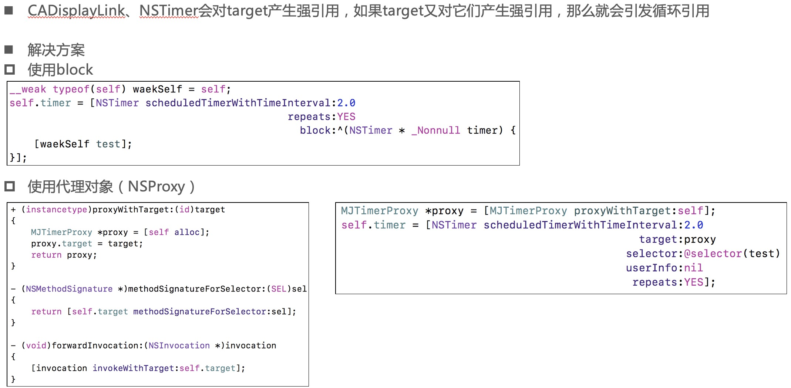

### 11.1.2 GCD定时器
* NSTimer依赖于RunLoop，如果RunLoop的任务过于繁重，可能会导致NSTimer不准时
* 而GCD的定时器会更加准时


## 11.2 内存布局

### 11.2.1 iOS程序的内存布局


### 11.2.2 Tagged Pointer
从64bit开始，iOS引入了Tagged Pointer技术，用于优化NSNumber、NSDate、NSString等小对象的存储

在没有使用Tagged Pointer之前， NSNumber等对象需要动态分配内存、维护引用计数等，NSNumber指针存储的是堆中NSNumber对象的地址值

使用Tagged Pointer之后，NSNumber指针里面存储的数据变成了：Tag + Data，也就是将数据直接存储在了指针中

当指针不够存储数据时，才会使用动态分配内存的方式来存储数据

objc_msgSend能识别Tagged Pointer，比如NSNumber的intValue方法，直接从指针提取数据，节省了以前的调用开销

如何判断一个指针是否为Tagged Pointer？
iOS平台，最高有效位是1（第64bit）
Mac平台，最低有效位是1

### 11.2.3 判断是否为Tagged Pointer


## 11.3 对象的内存管理

### 11.3.1 OC对象的内存管理
在iOS中，使用引用计数来管理OC对象的内存

一个新创建的OC对象引用计数默认是1，当引用计数减为0，OC对象就会销毁，释放其占用的内存空间

调用retain会让OC对象的引用计数+1，调用release会让OC对象的引用计数-1

内存管理的经验总结
当调用alloc、new、copy、mutableCopy方法返回了一个对象，在不需要这个对象时，要调用release或者autorelease来释放它
想拥有某个对象，就让它的引用计数+1；不想再拥有某个对象，就让它的引用计数-1

可以通过以下私有函数来查看自动释放池的情况
extern void _objc_autoreleasePoolPrint(void);


### 11.3.2 copy和mutableCopy


### 11.3.3 引用计数的存储


### 11.3.4 dealloc
当一个对象要释放时，会自动调用dealloc，接下的调用轨迹是

dealloc
_objc_rootDealloc
rootDealloc
object_dispose
objc_destructInstance、free


## 11.4 自动释放池

### 11.4.1 自动释放池
自动释放池的主要底层数据结构是：__AtAutoreleasePool、AutoreleasePoolPage

调用了autorelease的对象最终都是通过AutoreleasePoolPage对象来管理的

源码分析
clang重写@autoreleasepool
objc4源码：NSObject.mm


### 11.4.2 AutoreleasePoolPage的结构

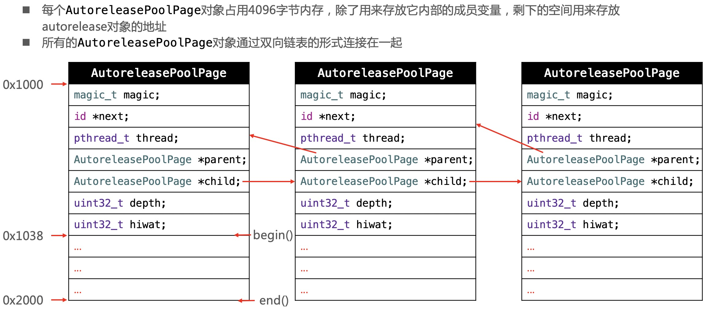

调用push方法会将一个POOL_BOUNDARY入栈，并且返回其存放的内存地址

调用pop方法时传入一个POOL_BOUNDARY的内存地址，会从最后一个入栈的对象开始发送release消息，直到遇到这个POOL_BOUNDARY

id *next指向了下一个能存放autorelease对象地址的区域  

### 11.4.3 Runloop和Autorelease
iOS在主线程的Runloop中注册了2个Observer
第1个Observer监听了kCFRunLoopEntry事件，会调用objc_autoreleasePoolPush()
第2个Observer
监听了kCFRunLoopBeforeWaiting事件，会调用objc_autoreleasePoolPop()、objc_autoreleasePoolPush()
监听了kCFRunLoopBeforeExit事件，会调用objc_autoreleasePoolPop()

